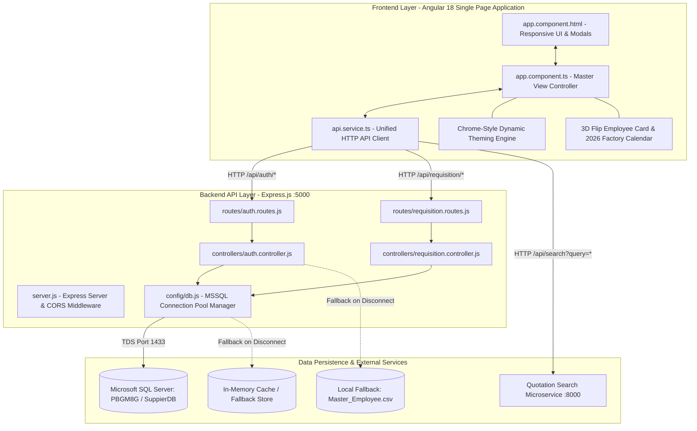
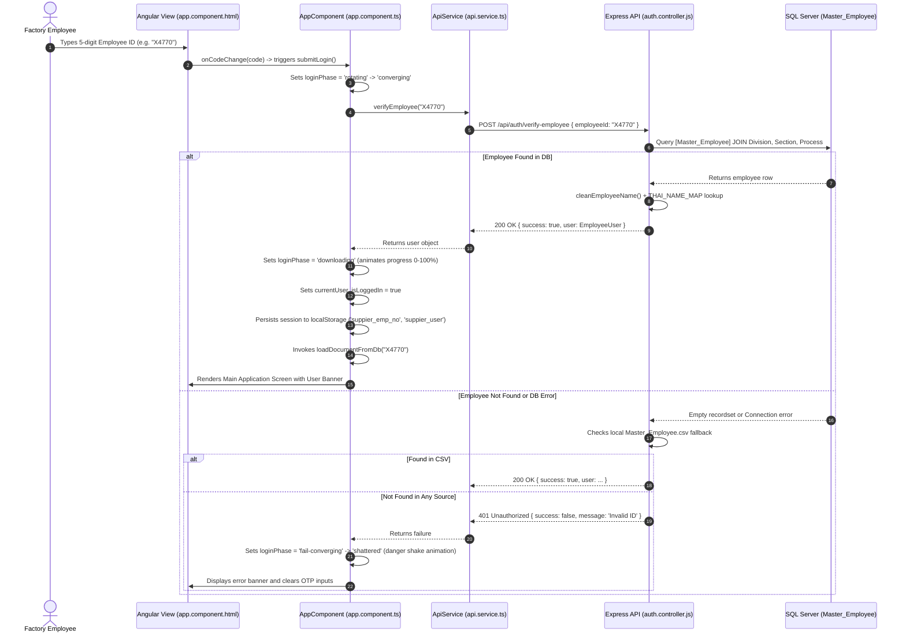
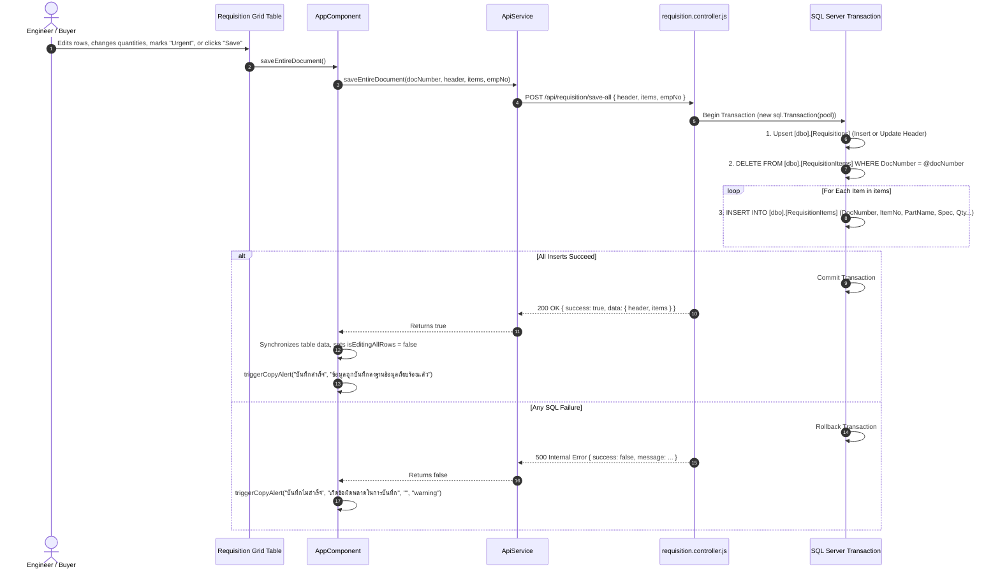
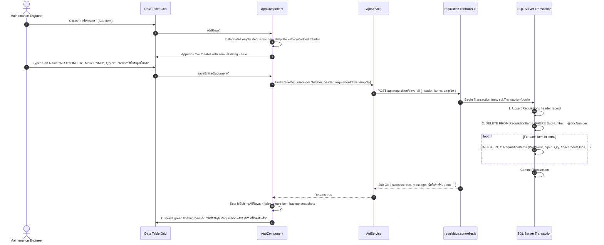
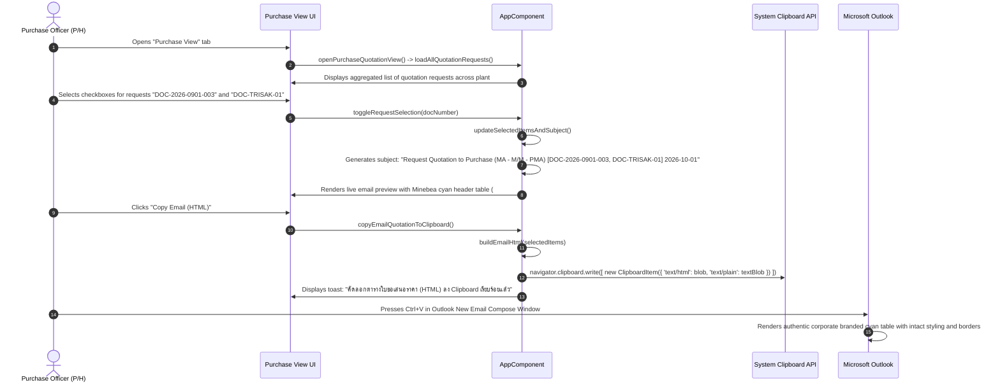
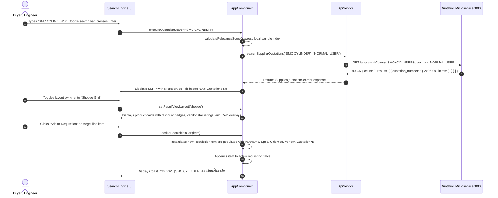

# Developer Manual: Suppier (MinebeaMitsumi Requisition & Quotation System)

---

## 1. System Overview & Architecture

### Purpose & Scope
**Suppier** is an enterprise-grade manufacturing procurement and requisition management platform designed specifically for **MinebeaMitsumi (Thailand) Co., Ltd.** (Bang Pa-in and Rojana factory plants). The application streamlines the workflow of **Request Quotation to Purchase (GM1 - MA - PMA)** across engineering, machine maintenance, assembly, quality assurance, and procurement departments.

Key user personas and operational roles:
1. **Factory Operators & Technicians (M/M, ASSY, MC, PE, ENG)**: Rapidly log machine breakdowns, register damaged spare parts, attach technical drawings/specifications, and request vendor quotations.
2. **Maintenance Supervisors & Section Heads**: Review, approve, prioritize (Normal vs. Urgent), and manage the budget division for incoming spare part requests.
3. **Purchase Officers & Buyers (P/H Section)**: Aggregate quotation requests across all divisions, search vendor catalogues, query historical and contracted unit prices, generate standardized MinebeaMitsumi branded quotation request emails, and dispatch them to approved suppliers.
4. **Plant Management & Cost Reduction Teams (C/R, FC, GA)**: Audit requisition histories, track lead times, compare multi-vendor quotations, and enforce procurement cost standards.

---

### Tech Stack Summary

| Layer | Technology | Version | Purpose & Justification |
| :--- | :--- | :--- | :--- |
| **Frontend Framework** | [Angular](https://angular.dev/) | `18.2.21` | Modern standalone component architecture, zoneless change detection readiness, typed forms, and enterprise reactivity. |
| **Frontend Language** | [TypeScript](https://www.typescriptlang.org/) | `~5.5.2` | Strict type safety, interface enforcement, and seamless modern ESNext compilation. |
| **Styling & Design System** | [Tailwind CSS](https://tailwindcss.com/) / Vanilla CSS | `^3.4.19` | Rapid utility styling paired with deep custom 3D transforms, glassmorphism, circuit overlays, and dynamic theme tokens. |
| **Post-Processing** | [PostCSS](https://postcss.org/) & [Autoprefixer](https://github.com/postcss/autoprefixer) | `^8.5.28` / `^10.6.1` | Vendor prefixing and cross-browser CSS normalization. |
| **Backend Runtime** | [Node.js](https://nodejs.org/) | `>= 20.x` (Tested on v24.16.0) | High-throughput asynchronous event-driven I/O engine. |
| **Backend Framework** | [Express](https://expressjs.com/) | `^4.19.2` | Lightweight, modular REST API server routing and middleware pipeline. |
| **Database Connector** | [mssql](https://www.npmjs.com/package/mssql) | `^10.0.2` | Native TDS protocol driver with built-in connection pooling and transactional queries for Microsoft SQL Server. |
| **Database Engine** | [Microsoft SQL Server](https://www.microsoft.com/sql-server) | 2016+ / Express | Enterprise relational database hosting `Suppier` database on server `PBGM8G`. |
| **External Microservice** | Quotation Search Engine | Fast/REST (`:8000`) | Secondary Python/FastAPI microservice executing high-speed vector/fuzzy text queries across vendor quote archives. |
| **Process Management** | Windows Batch Scripts | `cmd.exe` | Dual-service orchestration (`start.bat` and `stop.bat`) for zero-configuration developer launch. |

---

### Architecture & System Design

The platform adopts a decoupled **Client-Server Micro-Services Hybrid Architecture** with dual-mode operational resilience:



#### Key Architectural Patterns:
1. **Graceful Degradation & In-Memory Fallback Pattern**:
   Both backend controllers ([auth.controller.js](file:///D:/suppier/Suppier/backend/controllers/auth.controller.js) and [requisition.controller.js](file:///D:/suppier/Suppier/backend/controllers/requisition.controller.js)) and the frontend client ([api.service.ts](file:///D:/suppier/Suppier/src/app/services/api.service.ts)) implement multi-tiered fallback handlers. If Microsoft SQL Server is offline, unreachable, or in development mode, the backend automatically transitions to memory state and local CSV lookups without throwing unhandled exceptions.
2. **Transactional Rehydration & Atomic Persistence**:
   The `POST /api/requisition/save-all` endpoint utilizes SQL Server transactions (`sql.Transaction`). It atomically updates the requisition header, purges existing item rows for that document number, and batch re-inserts all line items, rolling back entirely if any constraint or type check fails.
3. **Dual View / Role-Adaptive Layout (Purchase vs. Normal User)**:
   The UI dynamically shifts its data projections based on whether the logged-in user belongs to `P/H` (Purchase) or an engineering/maintenance department, allowing instant access to multi-document aggregation and email generation.
4. **Google SERP & Shopee Hybrid Search Pattern**:
   The quotation search engine supports instant switching between an authentic Google Search Results Page (SERP) layout and an e-commerce (Shopee) product grid with sorting, price bounds, rating filters, and CAD PCB overlays.

---

### Directory & File Map

```text
d:\suppier\Suppier\
├── .angular/                       # Angular build cache and compiler metadata
├── .vscode/                        # Visual Studio Code tasks, extensions, and launch configs
│   ├── extensions.json             # Recommended extensions (Angular, Tailwind, ESLint)
│   ├── launch.json                 # Debugger configurations for Edge and Node
│   └── tasks.json                  # VS Code task definitions
├── backend/                        # Node.js Express Backend Service (Port 5000)
│   ├── config/
│   │   └── db.js                   # MSSQL Connection pooling & fallback state detection
│   ├── controllers/
│   │   ├── auth.controller.js      # 5-digit employee ID authentication & Master_Employee query
│   │   └── requisition.controller.js# Requisition CRUD, transactional save-all, all-requests query
│   ├── routes/
│   │   ├── auth.routes.js          # /api/auth routing definitions
│   │   └── requisition.routes.js   # /api/requisition routing definitions
│   ├── scripts/
│   │   ├── clear-db.js             # DB truncation, identity reseed, and re-seeding CLI script
│   │   └── init-db.js              # DDL schema initialization & default seed data generator
│   ├── .env                        # Live backend configuration (DB server, ports, credentials)
│   ├── .env.example                # Template configuration file for deployment onboarding
│   ├── package.json                # Backend dependencies (express, mssql, cors, dotenv, nodemon)
│   ├── README.md                   # Backend architecture and API quick reference
│   └── server.js                   # Express application entrypoint, middleware, and request logging
├── public/                         # Public assets served statically by Angular
│   ├── badge_back_card.png         # High-resolution back template for MinebeaMitsumi ID badge
│   ├── minebea-official-logo.png   # Official corporate emblem of MinebeaMitsumi
│   ├── facebook-default-avatar.svg # Fallback avatar SVG for user profiles without photos
│   └── sample-badge-photo.png      # High-fidelity sample technician portrait
├── src/                            # Angular 18 Source Code (Port 4200)
│   ├── app/
│   │   ├── services/
│   │   │   └── api.service.ts      # Unified Angular HTTP service connecting to Ports 5000 and 8000
│   │   ├── app.component.css       # Deep CSS styling: OTP orbit animations, 3D flip card, PCB styling
│   │   ├── app.component.html      # Master HTML template (6,173 lines) covering all 6 system views & modals
│   │   ├── app.component.spec.ts   # Jasmine/Karma unit testing suite for AppComponent
│   │   ├── app.component.ts        # Master Component Controller (4,998 lines) implementing all 169 methods
│   │   ├── app.config.ts           # Application config: zone coalescing and router provider
│   │   └── app.routes.ts           # Route definitions (SPA single-route shell)
│   ├── index.html                  # HTML5 document entrypoint with Google Fonts (Outfit, Inter)
│   ├── main.ts                     # Angular bootstrapping bootstrapApplication(AppComponent)
│   └── styles.css                  # Global Tailwind imports, CSS variables, and Chrome drawer tokens
├── angular.json                    # Angular CLI build, asset, and architect configuration
├── package.json                    # Frontend package dependencies (Angular 18, RxJS, Tailwind, Karma)
├── README.md                       # High-level project summary
├── start.bat                       # One-click Windows launch script (Spawns Backend, Frontend, and Edge)
├── stop.bat                        # Windows port-kill script (Terminates processes on Ports 5000 & 4200)
├── tailwind.config.js              # Tailwind CSS utility and responsive breakpoint configuration
├── tsconfig.app.json               # TypeScript configuration for Angular compilation
├── tsconfig.json                   # Root TypeScript compiler options
└── tsconfig.spec.json              # TypeScript configuration for unit tests
```

---

## 2. Local Environment Setup & Workflow

### Prerequisites
Before running or developing on the platform, ensure the following software is installed on the host operating system:

| Tool | Recommended Version | Verification Command | Notes |
| :--- | :--- | :--- | :--- |
| **Node.js** | `v20.x` or `v24.x` LTS | `node -v` | JavaScript runtime powering both build tools and the backend server. |
| **npm** | `10.x` or higher | `npm -v` | Package manager. |
| **Angular CLI** | `18.2.21` | `ng version` | Installed globally or executed via `npx ng`. |
| **Microsoft SQL Server** | 2016 / 2019 / 2022 | SSMS / `sqlcmd` | Database server hosting `SuppierDB` on local or network host (`PBGM8G`). |
| **Microsoft Edge / Chrome** | Latest Stable | `msedge --version` | Target browser for testing Chrome-style drawers and 3D transforms. |
| **Git** | `2.40+` | `git --version` | Version control. |

---

### Environment Variables

The backend relies on environment variables defined in [backend/.env](file:///D:/suppier/Suppier/backend/.env). An example template is provided in [backend/.env.example](file:///D:/suppier/Suppier/backend/.env.example).

| Key | Description | Default / Example Value | Required? |
| :--- | :--- | :--- | :--- |
| `PORT` | HTTP Port where the Express API server listens | `5000` | Yes |
| `DB_SERVER` | Hostname or IP address of the Microsoft SQL Server instance | `PBGM8G` or `localhost` | Yes |
| `DB_PORT` | Port number for SQL Server TDS communication | `1433` | Yes |
| `DB_USER` | SQL Server Authentication username | `Cost_Team` or `sa` | Yes |
| `DB_PASSWORD` | SQL Server Authentication user password | `Cost@User1` | Yes |
| `DB_NAME` | Target database name containing requisition tables | `Suppier` or `SuppierDB` | Yes |
| `CORS_ORIGIN` | Allowed origin URL for cross-origin Angular client requests | `http://localhost:4200` | Yes |
| `JWT_SECRET` | Secret signing key for future token-based auth | `your_super_secret_jwt_key_here` | Optional |

> [!NOTE]
> If the SQL Server specified in `DB_SERVER` is unreachable, the backend logs a warning and automatically falls back to Mock Data Mode. Developers can build and test frontend features without an active database connection.

---

### Setup & Build Instructions

#### Option A: One-Click Windows Automated Launcher (Recommended)
Double-click [start.bat](file:///D:/suppier/Suppier/start.bat) from the project root directory, or execute in PowerShell:
```powershell
cd d:\suppier\Suppier
.\start.bat
```
**What `start.bat` does automatically:**
1. Starts the Express Backend in a dedicated terminal window on port `5000`.
2. Starts the Angular Dev Server in a separate terminal window on port `4200`.
3. Waits 6 seconds for services to compile and bind ports.
4. Detects Microsoft Edge installation path and automatically launches `http://localhost:4200`.

To cleanly terminate all running services, run [stop.bat](file:///D:/suppier/Suppier/stop.bat):
```powershell
.\stop.bat
```
This script queries `netstat` for process IDs listening on ports `5000` and `4200` and forcefully kills them via `taskkill`.

---

#### Option B: Manual Step-by-Step Developer Launch

##### 1. Backend Installation & Startup
```bash
# 1. Navigate to backend directory
cd d:\suppier\Suppier\backend

# 2. Install dependencies
npm install

# 3. Initialize database tables and seed records (if running on real SQL Server)
npm run init-db # or: node scripts/init-db.js

# 4. Start backend in development mode (with nodemon auto-reload)
npm run dev
# OR start standard production mode:
npm start
```
Backend will log:
```text
🚀 [Server] Backend running on http://localhost:5000
🔌 [Database] Connecting to PBGM8G:1433/Suppier...
✅ [Database] Connected successfully to SQL Server!
```

##### 2. Frontend Installation & Startup
Open a second terminal window:
```bash
# 1. Navigate to project root
cd d:\suppier\Suppier

# 2. Install frontend dependencies
npm install

# 3. Launch Angular development server
npm start # runs: ng serve
```
Angular will compile and serve at: `http://localhost:4200/`.

##### 3. Database Maintenance Commands
Within `d:\suppier\Suppier\backend`:
```bash
# Reset database and reseed initial sample records:
npm run reset-db # runs: node scripts/clear-db.js --seed

# Wipe requisition data for a specific employee account:
node scripts/clear-db.js --emp=PEERAPAT

# Wipe all requisition tables completely:
npm run clear-db # runs: node scripts/clear-db.js
```

##### 4. Frontend Production Build & Testing
```bash
# Build production bundle (artifacts stored in /dist/suppier)
npm run build

# Run unit tests via Karma and Chrome Headless
npm test
```


---

## 3. Data Models & State Management

### Database / Schema Specs

The persistence tier is designed for **Microsoft SQL Server** running under database `[Suppier]`. Below are the complete DDL schemas, constraints, indexes, and field descriptions:

#### 1. Table: `[dbo].[Requisitions]` (Document Header)
Stores the master requisition metadata, requester section info, order priority, approval notes, and routing lists.

```sql
CREATE TABLE [dbo].[Requisitions] (
    DocNumber        NVARCHAR(50) PRIMARY KEY,       -- Format: 'DOC-YYYY-MMDD-NNN' or 'DOC-{EmpNo}'
    EmpNo            NVARCHAR(50) NULL,              -- Owner Employee ID (e.g. 'PEERAPAT', 'X4770')
    DocDate          NVARCHAR(50) NULL,              -- Timestamp string: 'DD/MM/YYYY HH:mm'
    Status           NVARCHAR(100) DEFAULT 'Waiting for purchase approve',
    RequestBy        NVARCHAR(50) NOT NULL,          -- Requester Full Name
    Division         NVARCHAR(20) NOT NULL,          -- Factory Division Code ('MA', 'GM', 'PMC')
    Section          NVARCHAR(20) NOT NULL,          -- Section Code ('M/M', 'P/H', 'ENG', 'ASSY')
    SectionName      NVARCHAR(50) NULL,              -- Full Section Name (e.g. 'MACHINE MAINTENANCE')
    Priority         NVARCHAR(50) DEFAULT 'NORMAL',  -- 'NORMAL' | 'URGENT' | 'HIGH'
    PriorityReason   NVARCHAR(255) NULL,             -- Justification for urgency or requisition
    OrderType        NVARCHAR(100) DEFAULT 'Spare Part M/C', -- Requisition category
    OrderTypeDesc    NVARCHAR(255) NULL,             -- Thai operational description
    SendToPurchase   NVARCHAR(255) NULL,             -- Comma-separated list of assigned buyers
    CC               NVARCHAR(255) DEFAULT '-',      -- Carbon-copy recipients
    ApprovalComment  NVARCHAR(255) NULL,             -- Managerial approval or budget sign-off notes
    CreatedAt        DATETIME DEFAULT GETDATE(),     -- Record creation timestamp
    UpdatedAt        DATETIME DEFAULT GETDATE()      -- Last modification timestamp
);

CREATE INDEX IX_Requisitions_EmpNo ON [dbo].[Requisitions](EmpNo);
CREATE INDEX IX_Requisitions_Status ON [dbo].[Requisitions](Status);
```

---

#### 2. Table: `[dbo].[RequisitionItems]` (Line Items)
Stores individual requested parts, machine linkage, dual vendor quotation comparisons, pricing, lead time, and PDF file references.

```sql
CREATE TABLE [dbo].[RequisitionItems] (
    ID               INT IDENTITY(1,1) PRIMARY KEY,  -- Auto-incrementing primary key
    DocNumber        NVARCHAR(50) NOT NULL,          -- Foreign key reference to Requisitions(DocNumber)
    EmpNo            NVARCHAR(50) NULL,              -- Employee Code owner
    ItemNo           INT NOT NULL,                   -- Line sequence number (1, 2, 3...)
    PartName         NVARCHAR(100) NOT NULL,         -- Part Name or Description
    Spec             NVARCHAR(MAX) NULL,             -- Technical specification / dimensions
    Position         NVARCHAR(100) NULL,             -- Machine station or mounting position
    MakerName        NVARCHAR(50) NULL,              -- Component manufacturer (e.g. 'SMC', 'FEDEX')
    Qty              DECIMAL(10,2) DEFAULT 1.0,      -- Requested quantity
    Unit             NVARCHAR(20) DEFAULT 'PCS',     -- Unit of measurement ('PCS', 'SET', 'MTR')
    PoRef            NVARCHAR(50) NULL,              -- Previous Purchase Order reference
    Remark           NVARCHAR(255) NULL,             -- Technician or buyer remarks
    IsUrgent         BIT DEFAULT 0,                  -- 1 = Urgent (Machine breakdown), 0 = Normal
    AttachmentsJson  NVARCHAR(MAX) NULL,             -- JSON string array of attached file objects
    MachineModel     NVARCHAR(255) NULL,             -- Machine model or line identifier
    MachineMaker     NVARCHAR(100) NULL,             -- Machine tool builder (e.g. 'Cleanvy#02')
    SerialNo         NVARCHAR(50) NULL,              -- Machine serial number
    
    -- Quotation 1 (Primary Vendor)
    AcCode           NVARCHAR(50) NULL,              -- Accounting / Account Code
    Vendor           NVARCHAR(50) NULL,              -- Vendor name / supplier code
    UnitPrice        DECIMAL(18,2) NULL,             -- Quoted unit price
    Currency         NVARCHAR(20) DEFAULT 'BT',      -- Currency code ('BT' / 'THB', 'USD', 'JPY')
    CrCode           NVARCHAR(50) NULL,              -- Credit term code
    QuotationNo      NVARCHAR(50) NULL,              -- Supplier quotation reference number
    QuotationPdf     NVARCHAR(255) NULL,             -- Uploaded quotation PDF filename
    LeadTime         NVARCHAR(50) NULL,              -- Delivery lead time (e.g. '20-25 DAYS')
    
    -- Quotation 2 (Alternative / Secondary Vendor for Comparison)
    AcCode2          NVARCHAR(50) NULL,              -- Secondary Accounting Code
    Vendor2          NVARCHAR(50) NULL,              -- Secondary Vendor name
    UnitPrice2       DECIMAL(18,2) NULL,             -- Secondary quoted unit price
    Currency2        NVARCHAR(20) DEFAULT 'BT',      -- Secondary currency code
    CrCode2          NVARCHAR(50) NULL,              -- Secondary Credit term code
    QuotationNo2     NVARCHAR(50) NULL,              -- Secondary Quotation reference number
    QuotationPdf2    NVARCHAR(255) NULL,             -- Secondary quotation PDF filename
    LeadTime2        NVARCHAR(50) NULL,              -- Secondary delivery lead time
    
    Status           NVARCHAR(50) DEFAULT 'Waiting Quotation', -- 'Waiting Quotation'|'Quoted'|'Approved'|'PO Issued'
    CreatedAt        DATETIME DEFAULT GETDATE(),
    UpdatedAt        DATETIME DEFAULT GETDATE(),

    CONSTRAINT FK_RequisitionItems_DocNumber 
        FOREIGN KEY (DocNumber) REFERENCES [dbo].[Requisitions](DocNumber) 
        ON DELETE CASCADE
);

CREATE INDEX IX_RequisitionItems_DocNumber ON [dbo].[RequisitionItems](DocNumber);
CREATE INDEX IX_RequisitionItems_PartName ON [dbo].[RequisitionItems](PartName);
```

---

#### 3. Enterprise Master Tables (Read-Only Integration)
The authentication controller queries existing enterprise personnel master tables located in the same database:

```sql
-- Master Employee Directory
CREATE TABLE [dbo].[Master_Employee] (
    User_Id             INT PRIMARY KEY,
    Emp_No              NVARCHAR(20) UNIQUE NOT NULL, -- 4 to 5-digit Employee ID (e.g. 'X4770', 'TK212')
    Name                NVARCHAR(150) NOT NULL,       -- Full English name (e.g. 'MR. DANUPHON SUTTHIWATTHANAK')
    Profile_Picture_Url NVARCHAR(255) NULL,           -- URL to factory badge JPEG portrait
    Division_Id         INT NULL,
    Section_Id          INT NULL,
    Process_Id          INT NULL,
    Position_Group      NVARCHAR(50) NULL,            -- 'STAFF', 'OPERATOR', 'TECHNICIAN'
    ShiftGroup_Code     NVARCHAR(10) NULL,            -- Factory shift ('A', 'B', 'C')
    Deleted_At          DATETIME NULL
);

-- Master Divisions, Sections, and Processes
CREATE TABLE [dbo].[Master_Division] (
    Division_Id         INT PRIMARY KEY,
    Division_Code       NVARCHAR(20),
    Division_Name       NVARCHAR(100),
    Division_Purchase   NVARCHAR(50)                  -- Mapping to Procurement Division identifier
);

CREATE TABLE [dbo].[Master_Section] (
    Section_Id          INT PRIMARY KEY,
    Section_Code        NVARCHAR(20),
    Section_Name        NVARCHAR(100)                 -- e.g. 'MACHINE MAINTENANCE'
);

CREATE TABLE [dbo].[Master_Process] (
    Process_Id          INT PRIMARY KEY,
    Process_Code        NVARCHAR(20),
    Process_Name        NVARCHAR(100)                 -- e.g. 'HEAT TREATMENT'
);
```

---

### State & Data Flow

#### 1. OTP Verification & Session Bootstrap Flow


---

#### 2. Requisition CRUD & Transactional Persistence Flow


---

### Types & Interfaces

All shared TypeScript data contracts are strictly defined in [src/app/services/api.service.ts](file:///D:/suppier/Suppier/src/app/services/api.service.ts) and [src/app/app.component.ts](file:///D:/suppier/Suppier/src/app/app.component.ts):

#### 1. User & Authentication Models
```typescript
export interface EmployeeUser {
  empNo: string;               // 4 to 5-digit employee ID (e.g. 'TK212', 'X4770')
  fullName: string;            // Cleaned English name without honorifics ('DANUPHON SUTTHIWATTHANAK')
  titleName?: string;          // Raw English name including prefix ('MR. DANUPHON SUTTHIWATTHANAK')
  rawName?: string;            // Original or Thai script name ('ดนุพล สุทธิวัฒนกุล')
  thaiName?: string;           // Looked-up Thai name from THAI_NAME_MAP
  division: string;            // Division abbreviation ('MA', 'GM', 'PMC')
  divisionName?: string;       // Full division title (e.g. 'MECHANICAL ASS\'Y')
  section: string;             // Factory Section abbreviation ('M/M', 'P/H', 'ENG')
  sectionName?: string;        // Full Section title ('MACHINE MAINTENANCE')
  process?: string;            // Production process ('HEAT TREATMENT', 'ASSEMBLY')
  processName?: string;        // Redundant field for template binding compatibility
  positionGroup?: string;      // Operational band ('STAFF', 'TECHNICIAN', 'OPERATOR')
  shiftGroup?: string;         // Working shift code ('A', 'B', 'C')
  profilePictureUrl?: string;  // Intranet URL to employee portrait JPEG
  empDate?: string;            // Employment hire date
  deletedAt?: string | null;   // Soft-delete marker
}

export interface VerifyEmployeeResponse {
  success: boolean;
  message: string;
  user?: EmployeeUser;
}
```

#### 2. Requisition Models
```typescript
export interface Attachment {
  name: string;                // Attached filename (e.g. '20250428140628.pdf')
  type: 'pdf' | 'doc' | 'image';
  size?: string;               // Human-readable size (e.g. '1.2 MB')
}

export interface RequisitionItem {
  id: number;                  // Database row ID or client timestamp
  no: number;                  // Item order sequence number
  partName: string;            // Spare part title / description
  spec: string;                // Technical dimensions, rating, or drawing spec
  position: string;            // Machine station / position
  makerName: string;           // Part brand / maker ('SMC', 'CLEANVY', 'AIRTAC')
  qty: number;                 // Requested count
  unit: string;                // 'PCS', 'SET', 'MTR', 'KG'
  remark: string;              // Notes, replacement urgency, or breakdown notes
  poRef?: string;              // Historical PO reference code
  isUrgent: boolean;           // True for emergency line-stoppage orders
  attachments?: Attachment[];  // Uploaded technical schematics
  
  // Machine Context (For M/M Maintenance Section)
  machineModel: string;        // e.g. 'HGM10152N / PMM F-4 / BROKEN'
  machineMaker: string;        // e.g. 'Cleanvy#02'
  serialNo: string;            // e.g. 'A06-026'
  
  // Procurement Detail (For P/H Purchase Section) - Quotation 1
  acCode: string;              // General Ledger / Account Code
  vendor: string;              // Quoted supplier name
  unitPrice: number | null;    // Unit price
  currency: string;            // 'BT' (THB), 'USD', 'JPY'
  crCode: string;              // Credit terms ('TX', '30D', '60D')
  quotationNo: string;         // Vendor quote number or 'WAIT'
  quotationPdf?: string;       // Attached quote PDF path
  leadTime: string;            // Quoted delivery time ('20-25 DAYS')
  
  // Quotation 2 (Alternative / Secondary Comparison)
  acCode2?: string;
  vendor2?: string;
  unitPrice2?: number | null;
  currency2?: string;
  crCode2?: string;
  quotationNo2?: string;
  quotationPdf2?: string;
  leadTime2?: string;
  
  status: 'Waiting Quotation' | 'Quoted' | 'Approved' | 'PO Issued';
  isEditing?: boolean;         // Client UI inline edit state flag
  backupData?: any;            // Snapshot stored during edit cancellation
}
```

#### 3. Quotation Search & Microservice Models
```typescript
export interface QuotationSearchResult {
  id: string;
  quotationNo: string;
  partName: string;
  spec: string;
  makerName: string;
  vendor: string;
  vendorRating?: number;
  unitPrice: number;
  originalPrice?: number;
  discountPercent?: number;
  currency: string;
  leadTime: string;
  status: 'Approved' | 'Quoted' | 'Waiting Quotation' | 'PO Issued';
  isUrgent: boolean;
  isMall?: boolean;
  location?: string;
  category?: string;
  soldCount?: string;
  voucherText?: string;
  stockCount?: number;
  partType?: 'cylinder' | 'vacuum' | 'linear' | 'sensor' | 'motor' | 'filter' | 'valve';
  docNumber: string;
  requesterName: string;
  division: string;
  section: string;
  quotationDate: string;
  quotationPdf?: string;
  machineModel?: string;
  descriptionSnippet: string;
  urlBreadcrumb: string;
  priceHistory?: Array<{ year: string; price: number; vendor: string }>;
  tags: string[];
  matchScore?: number;
  rank?: number;
}

export interface QuotationLineItem {
  item_number: number;
  part_number: string | null;
  description: string;
  quantity: number;
  unit: string;
  unit_price: number;
  total_price: number;
}

export interface SupplierQuotationResult {
  quotation_id: string;
  quotation_number: string;
  vendor_name: string;
  vendor_tax_id?: string | null;
  currency: string;
  status: 'ACTIVE' | 'EXPIRED';
  issue_date: string;
  expiration_date: string;
  confidence_score: number;
  can_receive: boolean;
  pdf_url: string;
  items: QuotationLineItem[];
}

export interface SupplierQuotationSearchResponse {
  query: string;
  count: number;
  results: SupplierQuotationResult[];
}

export interface SupplierItem {
  id: string;
  name: string;
  code: string;
  category: string;
  contactPerson?: string;
  phone?: string;
  email?: string;
  address?: string;
  taxId?: string;
  rating: number;
  status: 'ACTIVE' | 'INACTIVE' | 'PENDING';
  tags: string[];
  notes?: string;
  quotationCount?: number;
  lastQuoteDate?: string;
}

export interface ThemeOption {
  id: string;
  name: string;
  topColor: string;
  bottomLeftColor: string;
  bottomRightColor: string;
  lightBg: string;
  primary?: string;
  primaryDark?: string;
  secondary?: string;
}
```


---

## 4. Comprehensive Function & API Registry

### Part A: Backend Application & Controller Layer

#### Module: [backend/server.js](file:///D:/suppier/Suppier/backend/server.js)
The entrypoint for the Express REST API service.

---

##### 1. `app.use((req, res, next) => { ... })` (Request Logger Middleware)
- **Signature**: `loggerMiddleware(req: express.Request, res: express.Response, next: express.NextFunction): void`
- **Purpose**: Intercepts every incoming HTTP request to output structured terminal telemetry, recording start timestamp, HTTP method, target URL, parsed payload body, execution latency, and visual response status icons (✅ for success, ❌ for errors).
- **Parameters & Return Values**:
  - `req`: Incoming Express Request object.
  - `res`: Express Response object.
  - `next`: Next middleware execution delegate.
  - **Returns**: `void`.
- **Dependencies & Side Effects**: Attaches an event listener to `res.on('finish')`. Writes formatted logs to `console.log`.
- **Error Handling**: Non-blocking; passes execution unconditionally via `next()`.

---

##### 2. `app.get('/api/health', (req, res) => { ... })` (Health Check Endpoint)
- **Signature**: `healthCheck(req: express.Request, res: express.Response): express.Response`
- **Purpose**: Provides a lightweight liveness probe endpoint for uptime monitors, containers, and frontend connection verification.
- **Parameters & Return Values**:
  - `req`: Express Request.
  - `res`: Express Response.
  - **Returns**: JSON object: `{ status: 'online', system: 'Suppier Requisition API Backend', timestamp: string }`.
- **Dependencies & Side Effects**: Reads current system clock (`new Date().toISOString()`).
- **Error Handling**: Guaranteed 200 OK under operational server runtime.

---

##### 3. `app.listen(PORT, async () => { ... })` (Server Bootstrapper)
- **Signature**: `startServer(port: number, callback: () => Promise<void>): http.Server`
- **Purpose**: Binds the Express application to the configured TCP port and initiates the database connection pool.
- **Parameters & Return Values**:
  - `PORT`: Integer port number resolved from `process.env.PORT || 5000`.
  - **Returns**: Node.js `http.Server` instance.
- **Dependencies & Side Effects**: Calls `connectDB()` from [backend/config/db.js](file:///D:/suppier/Suppier/backend/config/db.js). Writes launch banners to standard output.
- **Error Handling**: Unhandled listen errors (e.g. `EADDRINUSE`) bubble to the Node.js process runtime.

---

#### Module: [backend/config/db.js](file:///D:/suppier/Suppier/backend/config/db.js)
Database connection pool configuration and driver abstraction for Microsoft SQL Server.

---

##### 4. `connectDB()`
- **Signature**: `connectDB(): Promise<sql.ConnectionPool | null>`
- **Purpose**: Lazily initializes and caches a singleton connection pool to Microsoft SQL Server using credentials from environment variables. If the database server is unreachable, it logs a descriptive warning and gracefully returns `null` to enable in-memory mock fallback mode across all controllers.
- **Parameters & Return Values**:
  - **Parameters**: None.
  - **Returns**: `Promise<sql.ConnectionPool | null>` - Resolves to the active MSSQL pool instance, or `null` if the connection failed.
- **Dependencies & Side Effects**: Reads `process.env.DB_USER`, `DB_PASSWORD`, `DB_SERVER`, `DB_PORT`, `DB_NAME`. Configures connection pool bounds (max: 10, min: 0, idleTimeout: 30000ms).
- **Error Handling**: Uses a `try...catch` block. Logs warnings via `console.warn` with connection error details without crashing the host Node process.

---

#### Module: [backend/controllers/auth.controller.js](file:///D:/suppier/Suppier/backend/controllers/auth.controller.js)
Handles employee identity verification against `[dbo].[Master_Employee]`, CSV fallback loading, name normalization, and section mapping.

---

##### 5. `cleanEmployeeName(rawName)`
- **Signature**: `cleanEmployeeName(rawName: string): string`
- **Purpose**: Strips formal English prefixes and honorifics (e.g. `MR.`, `MISS`, `MRS.`, `MS.`) from raw employee directory names and consolidates duplicate consecutive whitespace into single spaces.
- **Parameters & Return Values**:
  - `rawName` (`string`): Raw name string from database or CSV (e.g. `"MR.  DANUPHON  SUTTHIWATTHANAK"`).
  - **Returns**: `string` - Sanitized name (e.g. `"DANUPHON SUTTHIWATTHANAK"`), or empty string if falsy.
- **Dependencies & Side Effects**: Pure string processing regex utility. No side effects.
- **Error Handling**: Falsy guard (`if (!rawName) return '';`).

---

##### 6. `getSectionAbbreviation(sectionName)`
- **Signature**: `getSectionAbbreviation(sectionName: string): string`
- **Purpose**: Translates long factory section names into standardized MinebeaMitsumi factory abbreviations.
- **Parameters & Return Values**:
  - `sectionName` (`string`): Full section title (e.g. `"MACHINE MAINTENANCE"`, `"QUALITY CONTROL"`, `"PURCHASE"`).
  - **Returns**: `string` - Abbreviated code (e.g. `"M/M"`, `"Q/C"`, `"P/H"`, `"ENG"`, `"ASSY"`, `"MC"`). If no mapping exists, returns the original section name.
- **Dependencies & Side Effects**: Uses internal dictionary `map`.
- **Error Handling**: Falsy guard (`if (!sectionName) return '';`).

---

##### 7. `findEmployeeFromCsv(empCode)`
- **Signature**: `findEmployeeFromCsv(empCode: string): object | null`
- **Purpose**: Inspects the local fallback file `Master_Employee.csv` when the database connection is interrupted or during offline development.
- **Parameters & Return Values**:
  - `empCode` (`string`): Uppercase 4-5 digit employee ID.
  - **Returns**: Record object `{ User_Id, Emp_No, Name, Profile_Picture_Url, Division_Id, Section_Id, Process_Id }` or `null` if not found or file is missing.
- **Dependencies & Side Effects**: Reads disk file synchronously via `fs.readFileSync`.
- **Error Handling**: Wraps filesystem operations in `try...catch`; logs error messages to `console.error` and returns `null`.

---

##### 8. `verifyEmployee(req, res)`
- **Signature**: `verifyEmployee(req: express.Request, res: express.Response): Promise<express.Response>`
- **Purpose**: HTTP Controller for `POST /api/auth/verify-employee`. Validates employee code format (4-5 characters), queries `[dbo].[Master_Employee]` with SQL joins across `Master_Division`, `Master_Section`, and `Master_Process`. If missing or offline, attempts CSV fallback. Enriches user profile with Thai script name, division mappings, and position groups.
- **Parameters & Return Values**:
  - `req.body.employeeId` (`string`): The submitted employee code.
  - **Returns**: JSON response:
    - Success (200): `{ success: true, message: string, user: EmployeeUser }`
    - Bad Request (400): `{ success: false, message: 'กรุณาระบุรหัสพนักงานให้ถูกต้อง (4-5 หลัก)' }`
    - Unauthorized (401): `{ success: false, message: 'รหัสพนักงานไม่ถูกต้อง...' }`
    - Server Error (500): `{ success: false, message: 'เกิดข้อผิดพลาดภายในระบบ...' }`
- **Dependencies & Side Effects**: Calls `connectDB()`, executes parameterized SQL query with `@code`, queries CSV if needed.
- **Error Handling**: Validates input length. Wraps execution in `try...catch`; returns HTTP 500 on unexpected exceptions.

---

#### Module: [backend/controllers/requisition.controller.js](file:///D:/suppier/Suppier/backend/controllers/requisition.controller.js)
Coordinates requisition document retrieval, header updates, transactional bulk line item saves, and multi-user purchase order views.

---

##### 9. `mapDbItemToFrontend(dbItem)`
- **Signature**: `mapDbItemToFrontend(dbItem: object): RequisitionItem`
- **Purpose**: Transforms a PascalCase SQL Server database record from `[dbo].[RequisitionItems]` into camelCase JavaScript/TypeScript data objects expected by the Angular frontend. Safely deserializes `AttachmentsJson` from JSON string to an array.
- **Parameters & Return Values**:
  - `dbItem` (`object`): SQL Server recordset row object.
  - **Returns**: `RequisitionItem` object with parsed `attachments`, numeric castings (`qty`, `unitPrice`), boolean `isUrgent`, and default string fallbacks.
- **Dependencies & Side Effects**: Pure mapping function.
- **Error Handling**: Contains internal `try...catch` to parse `dbItem.AttachmentsJson`, defaulting to `[]` on JSON syntax errors.

---

##### 10. `mapDbDocToFrontend(dbDoc)`
- **Signature**: `mapDbDocToFrontend(dbDoc: object): object`
- **Purpose**: Transforms a PascalCase SQL Server record from `[dbo].[Requisitions]` into a frontend camelCase document header object.
- **Parameters & Return Values**:
  - `dbDoc` (`object`): SQL recordset row representing the requisition header.
  - **Returns**: Header object containing `docNumber`, `empNo`, `docDate`, `status`, `requestBy`, `division`, `section`, `sectionName`, `priority`, `orderType`, `sendToPurchase`, `cc`, `approvalComment`.
- **Dependencies & Side Effects**: Pure mapping function.
- **Error Handling**: Fallbacks to empty strings or default values for missing properties.

---

##### 11. `getDocumentByAccount(req, res)`
- **Signature**: `getDocumentByAccount(req: express.Request, res: express.Response): Promise<express.Response>`
- **Purpose**: HTTP Controller for `GET /api/requisition/account/:empNo`. Fetches the active requisition document and line items for a specific employee ID. If the employee does not have an existing document, queries `Master_Employee` to create a tailored blank document template with requester name, division, and section pre-filled, without inserting dummy rows into the database until explicitly saved.
- **Parameters & Return Values**:
  - `req.params.empNo` (`string`): Target employee identifier.
  - **Returns**: JSON response `{ success: true, data: { header: object, items: RequisitionItem[] } }`.
- **Dependencies & Side Effects**: Queries `Requisitions`, `RequisitionItems`, and `Master_Employee`. Uses `MOCK_DOCUMENTS_BY_EMP` and `MOCK_ITEMS_BY_DOC` in fallback mode.
- **Error Handling**: Validates `empNo` parameter (returns 400 if empty). Catches database query errors and returns HTTP 500.

---

##### 12. `getDocument(req, res)`
- **Signature**: `getDocument(req: express.Request, res: express.Response): Promise<express.Response>`
- **Purpose**: HTTP Controller for `GET /api/requisition/document/:docNumber?`. Retrieves a complete requisition document (header plus all line items ordered by `ItemNo ASC`) by its document number. Defaults to `'DOC-2026-0901-003'` if unspecified.
- **Parameters & Return Values**:
  - `req.params.docNumber` (`string`, optional): Document number.
  - **Returns**: JSON response `{ success: true, data: { header, items } }`.
- **Dependencies & Side Effects**: Queries database tables `Requisitions` and `RequisitionItems`. Falls back to in-memory store if offline.
- **Error Handling**: `try...catch` block logs database exceptions and returns HTTP 500 with descriptive error message.

---

##### 13. `updateDocument(req, res)`
- **Signature**: `updateDocument(req: express.Request, res: express.Response): Promise<express.Response>`
- **Purpose**: HTTP Controller for `PUT /api/requisition/document/:docNumber`. Performs an upsert (`IF EXISTS UPDATE ELSE INSERT`) on the `[dbo].[Requisitions]` header table for the specified document number.
- **Parameters & Return Values**:
  - `req.params.docNumber` (`string`): Document identifier.
  - `req.body` (`object`): Updated header fields (`docDate`, `status`, `requestBy`, `priority`, `orderType`, etc.).
  - **Returns**: JSON response `{ success: true, message: string, data: object }`.
- **Dependencies & Side Effects**: Updates or inserts row into `Requisitions`. Updates `UpdatedAt` timestamp.
- **Error Handling**: Wrapped in `try...catch`. Returns HTTP 500 on database failure.

---

##### 14. `saveAll(req, res)`
- **Signature**: `saveAll(req: express.Request, res: express.Response): Promise<express.Response>`
- **Purpose**: HTTP Controller for `POST /api/requisition/save-all`. Transactionally saves the entire requisition document (Header and all Line Items). Initiates an explicit SQL Server transaction, upserts the header, executes `DELETE FROM RequisitionItems WHERE DocNumber = @docNumber`, iterates through `items` to insert each row with serialized JSON attachments, and commits. Rolls back completely on failure.
- **Parameters & Return Values**:
  - `req.body.header` (`object`): Complete document header object. Must contain `docNumber`.
  - `req.body.items` (`RequisitionItem[]`): Array of line item objects.
  - `req.body.empNo` (`string`, optional): Active employee code.
  - **Returns**: JSON response `{ success: true, message: string, data: { header, items } }`.
- **Dependencies & Side Effects**: Mutates SQL Server database tables `Requisitions` and `RequisitionItems` atomically via `sql.Transaction`. Updates in-memory mock fallback if DB is offline.
- **Error Handling**: Validates `header.docNumber` (HTTP 400). If any item insert fails, triggers `await transaction.rollback()` and returns HTTP 500.

---

##### 15. `getAllItems(req, res)`
- **Signature**: `getAllItems(req: express.Request, res: express.Response): Promise<express.Response>`
- **Purpose**: HTTP Controller for `GET /api/requisition/items`. Fetches line items for a specific document number (`req.query.docNumber`).
- **Parameters & Return Values**:
  - `req.query.docNumber` (`string`, optional): Target document number (defaults to `DOC-2026-0901-003`).
  - **Returns**: JSON response `{ success: true, data: RequisitionItem[] }`.
- **Dependencies & Side Effects**: Queries `RequisitionItems` with sorting `ORDER BY ItemNo ASC`.
- **Error Handling**: Returns HTTP 500 on database execution error.

---

##### 16. `createItem(req, res)`
- **Signature**: `createItem(req: express.Request, res: express.Response): Promise<express.Response>`
- **Purpose**: HTTP Controller for `POST /api/requisition/items`. Inserts a single new line item into `[dbo].[RequisitionItems]`, automatically computing the next sequential `ItemNo` via `ISNULL(MAX(ItemNo), 0) + 1`. Returns the inserted row via SQL Server `OUTPUT INSERTED.*`.
- **Parameters & Return Values**:
  - `req.body` (`RequisitionItem`): Line item payload.
  - **Returns**: HTTP 201 Created with JSON `{ success: true, message: string, data: RequisitionItem }`.
- **Dependencies & Side Effects**: Writes row to `RequisitionItems`. Serializes attachments to JSON.
- **Error Handling**: Returns HTTP 500 on database constraint violation or connection error.

---

##### 17. `updateItem(req, res)`
- **Signature**: `updateItem(req: express.Request, res: express.Response): Promise<express.Response>`
- **Purpose**: HTTP Controller for `PUT /api/requisition/items/:id`. Updates an existing line item by its primary key ID, updating all machine specifications, quotation details, and setting `UpdatedAt = GETDATE()`.
- **Parameters & Return Values**:
  - `req.params.id` (`string`): Integer primary key ID of the item.
  - `req.body` (`RequisitionItem`): Updated fields.
  - **Returns**: JSON response `{ success: true, message: string, data: RequisitionItem }`. Returns 404 if item does not exist.
- **Dependencies & Side Effects**: Updates target record in `RequisitionItems`.
- **Error Handling**: Validates row existence via `OUTPUT INSERTED.*`. Returns HTTP 404 or 500.

---

##### 18. `deleteItem(req, res)`
- **Signature**: `deleteItem(req: express.Request, res: express.Response): Promise<express.Response>`
- **Purpose**: HTTP Controller for `DELETE /api/requisition/items/:id`. Permanently deletes a single requisition item by its primary key.
- **Parameters & Return Values**:
  - `req.params.id` (`string`): Target row ID.
  - **Returns**: JSON response `{ success: true, message: 'ลบรายการสำเร็จ' }`.
- **Dependencies & Side Effects**: Deletes record from `RequisitionItems`.
- **Error Handling**: Returns HTTP 500 on SQL failure.

---

##### 19. `getAllRequests(req, res)`
- **Signature**: `getAllRequests(req: express.Request, res: express.Response): Promise<express.Response>`
- **Purpose**: HTTP Controller for `GET /api/requisition/all-requests`. Provides the unified aggregation endpoint for the Purchase (P/H) section. Queries all requisition documents across the entire factory with subqueries calculating `TotalItems` and `PendingQuotationCount` (items where quotation number is missing, null, or 'WAIT'). Populates each document with its full list of line items. Supports optional filtering by employee code, doc number, or requester name.
- **Parameters & Return Values**:
  - `req.query.empNo` (`string`, optional): Filter string for searching specific employees or docs.
  - **Returns**: JSON response `{ success: true, data: Array<{ header: object, items: RequisitionItem[] }> }`.
- **Dependencies & Side Effects**: Executes joined subqueries across `Requisitions` and `RequisitionItems`. Ensures demo seed records (such as `TRISAK`) are merged if not yet persisted in database.
- **Error Handling**: Returns HTTP 500 on database failure.

---

#### Module: [backend/scripts/init-db.js](file:///D:/suppier/Suppier/backend/scripts/init-db.js)
Database initialization and default seed script.

---

##### 20. `initializeDatabase()`
- **Signature**: `initializeDatabase(): Promise<void>`
- **Purpose**: Standalone CLI setup script. Connects to SQL Server, verifies and executes DDL to create tables `[Requisitions]` and `[RequisitionItems]` if missing, checks for initial requisition document `DOC-2026-0901-003` (Peerapat Buasa), and seeds 4 initial spare part items (Axis Devec, Cleanvy Filter, Inside Distillation Coil, Outside Distillation Coil).
- **Parameters & Return Values**:
  - **Parameters**: None (runs as CLI script via `node scripts/init-db.js`).
  - **Returns**: `Promise<void>`. Exits process with code 0 on success, code 1 on error.
- **Dependencies & Side Effects**: Connects via `connectDB()`. Modifies database schema and inserts seed data.
- **Error Handling**: Catches errors, prints detailed diagnostics, and invokes `process.exit(1)`.

---

#### Module: [backend/scripts/clear-db.js](file:///D:/suppier/Suppier/backend/scripts/clear-db.js)
Database wiping and identity reset script.

---

##### 21. `clearDatabase()`
- **Signature**: `clearDatabase(): Promise<void>`
- **Purpose**: Standalone CLI cleanup script. Parses command-line arguments:
  - If `--emp=<EmpNo>` is passed: Deletes only records associated with that employee.
  - Otherwise: Wipes all rows from `RequisitionItems` and `Requisitions`, executes `DBCC CHECKIDENT ('RequisitionItems', RESEED, 0)` to reset auto-incrementing identity values.
  - If `--seed` is passed: Triggers `init-db.js` via `child_process.execSync` to re-seed default data immediately.
- **Parameters & Return Values**:
  - **Parameters**: None (parses `process.argv`).
  - **Returns**: `Promise<void>`.
- **Dependencies & Side Effects**: Connects via `connectDB()`. Deletes rows and reseeds SQL identity.
- **Error Handling**: Wraps database operations in a transaction; rolls back on failure and exits with code 1.


### Part B: Frontend Core & Services Layer

#### Module: [src/main.ts](file:///D:/suppier/Suppier/src/main.ts)
Client application bootstrapping entrypoint.

---

##### 22. `bootstrapApplication(AppComponent, appConfig)`
- **Signature**: `bootstrapApplication(rootComponent: Type<AppComponent>, options?: ApplicationConfig): Promise<ApplicationRef>`
- **Purpose**: Initializes the Angular 18 Single Page Application in standalone mode without traditional `NgModule` wrappers, attaching the root component `AppComponent` to the DOM element `<app-root>`.
- **Parameters & Return Values**:
  - `rootComponent`: The standalone root component class ([AppComponent](file:///D:/suppier/Suppier/src/app/app.component.ts)).
  - `options`: Application configuration provider bundle ([appConfig](file:///D:/suppier/Suppier/src/app/app.config.ts)).
  - **Returns**: `Promise<ApplicationRef>`.
- **Dependencies & Side Effects**: Configures Angular's root injector, renders the top-level template, and activates change detection.
- **Error Handling**: Chained with `.catch((err) => console.error(err))` to intercept fatal bootstrapping errors.

---

#### Module: [src/app/app.config.ts](file:///D:/suppier/Suppier/src/app/app.config.ts)
Global application configuration and dependency injection providers.

---

##### 23. `appConfig`
- **Signature**: `const appConfig: ApplicationConfig`
- **Purpose**: Aggregates enterprise Angular 18 providers:
  1. `provideZoneChangeDetection({ eventCoalescing: true })`: Coalesces rapid DOM micro-events into single change detection cycles to boost rendering performance.
  2. `provideRouter(routes)`: Configures the client router.
- **Parameters & Return Values**: Exported constant object of type `ApplicationConfig`.
- **Dependencies & Side Effects**: Configures root dependency injection.

---

#### Module: [src/app/services/api.service.ts](file:///D:/suppier/Suppier/src/app/services/api.service.ts)
The central client HTTP gateway mediating all communication with the Express Backend (Port 5000) and the Quotation Search Microservice (Port 8000).

---

##### 24. `verifyEmployee(employeeId)`
- **Signature**: `verifyEmployee(employeeId: string): Promise<VerifyEmployeeResponse>`
- **Purpose**: Submits the 5-digit employee code to the backend authentication endpoint (`POST http://localhost:5000/api/auth/verify-employee`). If the backend server is offline or network fails, automatically falls back to an internal hardcoded dictionary of known test employees (`X4770`, `A3415`, `TK212`, `AB326`, `6284B`) so UI testing remains completely operational.
- **Parameters & Return Values**:
  - `employeeId` (`string`): The raw or formatted employee ID string.
  - **Returns**: `Promise<VerifyEmployeeResponse>` - Resolves to `{ success: boolean, message: string, user?: EmployeeUser }`.
- **Dependencies & Side Effects**: Issues a `fetch()` request with JSON body. Emits colored console logs in DevTools.
- **Error Handling**: Wrapped in `try...catch`. When fetch throws, catches error, logs warning, and evaluates fallback accounts before returning failure.

---

##### 25. `getRequisitionDocumentForAccount(empNo)`
- **Signature**: `getRequisitionDocumentForAccount(empNo: string): Promise<{ header: any; items: any[] } | null>`
- **Purpose**: Retrieves the active requisition document and associated line items for the specific logged-in employee from `GET http://localhost:5000/api/requisition/account/:empNo`.
- **Parameters & Return Values**:
  - `empNo` (`string`): Target employee identifier (e.g. `'PEERAPAT'`).
  - **Returns**: `Promise<{ header: any; items: any[] } | null>` - Returns document data payload, or `null` if error or empty.
- **Dependencies & Side Effects**: Executes HTTP GET via native `fetch()`.
- **Error Handling**: Catches network/API exceptions, outputs `console.warn`, and safely returns `null`.

---

##### 26. `getRequisitionDocument(docNumber)`
- **Signature**: `getRequisitionDocument(docNumber = 'DOC-2026-0901-003'): Promise<{ header: any; items: any[] } | null>`
- **Purpose**: Retrieves a complete requisition document (header + items) by its unique document number string.
- **Parameters & Return Values**:
  - `docNumber` (`string`, optional): Document code (defaults to `'DOC-2026-0901-003'`).
  - **Returns**: `Promise<{ header: any; items: any[] } | null>`.
- **Dependencies & Side Effects**: Calls `GET /api/requisition/document/:docNumber`.
- **Error Handling**: Catches exceptions and returns `null`.

---

##### 27. `saveRequisitionHeader(docNumber, header, empNo)`
- **Signature**: `saveRequisitionHeader(docNumber: string, header: any, empNo?: string): Promise<boolean>`
- **Purpose**: Persists changes to the requisition document header (e.g., status, priority, order type, requester notes) via `PUT /api/requisition/document/:docNumber`.
- **Parameters & Return Values**:
  - `docNumber` (`string`): Target document number.
  - `header` (`any`): Updated header fields.
  - `empNo` (`string`, optional): Active employee code.
  - **Returns**: `Promise<boolean>` - Resolves `true` on HTTP 200 success, `false` otherwise.
- **Dependencies & Side Effects**: Issues HTTP PUT request with JSON payload.
- **Error Handling**: Catches network and serialization errors, logs to `console.error`, and returns `false`.

---

##### 28. `saveEntireDocument(docNumber, header, items, empNo)`
- **Signature**: `saveEntireDocument(docNumber: string, header: any, items: any[], empNo?: string): Promise<boolean>`
- **Purpose**: Sends the complete document payload (header and full item list) in a single transactional bulk save request to `POST /api/requisition/save-all`.
- **Parameters & Return Values**:
  - `docNumber` (`string`): Document identifier.
  - `header` (`any`): Header fields object.
  - `items` (`any[]`): Array of line item objects.
  - `empNo` (`string`, optional): Active employee identifier.
  - **Returns**: `Promise<boolean>` - `true` if backend committed the transaction, `false` on failure.
- **Dependencies & Side Effects**: Performs atomic transactional update on backend SQL Server.
- **Error Handling**: Catches fetch errors, logs to `console.error`, and returns `false`.

---

##### 29. `getRequisitionItems(docNumber)`
- **Signature**: `getRequisitionItems(docNumber = 'DOC-2026-0901-003'): Promise<any[]>`
- **Purpose**: Fetches the array of line items associated with a document via `GET /api/requisition/items?docNumber=...`.
- **Parameters & Return Values**:
  - `docNumber` (`string`, optional): Target document number.
  - **Returns**: `Promise<any[]>` - Array of items, or empty array `[]` on failure.
- **Dependencies & Side Effects**: Issues HTTP GET request.
- **Error Handling**: Catches network errors and returns fallback empty array `[]`.

---

##### 30. `saveRequisitionItem(item)`
- **Signature**: `saveRequisitionItem(item: any): Promise<boolean>`
- **Purpose**: Upserts an individual line item. Dynamically routes to `PUT /api/requisition/items/:id` if `item.id` is truthy, or `POST /api/requisition/items` to create a new item if `item.id` is absent.
- **Parameters & Return Values**:
  - `item` (`any`): Item payload.
  - **Returns**: `Promise<boolean>` - `true` on success, `false` on error.
- **Dependencies & Side Effects**: Modifies or inserts single row in database.
- **Error Handling**: Catches network and HTTP errors; returns `false`.

---

##### 31. `deleteRequisitionItem(id)`
- **Signature**: `deleteRequisitionItem(id: number): Promise<boolean>`
- **Purpose**: Permanently deletes a single requisition item by its numeric ID via `DELETE /api/requisition/items/:id`.
- **Parameters & Return Values**:
  - `id` (`number`): Item primary key.
  - **Returns**: `Promise<boolean>`.
- **Dependencies & Side Effects**: Deletes item from SQL Server table.
- **Error Handling**: Catches network errors and returns `false`.

---

##### 32. `getAllQuotationRequests(empNo)`
- **Signature**: `getAllQuotationRequests(empNo?: string): Promise<Array<{ header: any; items: any[] }>>`
- **Purpose**: Queries the multi-user aggregated quotation requests view via `GET /api/requisition/all-requests`. Used by the Purchase section to display all pending and quoted documents across the entire plant.
- **Parameters & Return Values**:
  - `empNo` (`string`, optional): Optional filter query string.
  - **Returns**: `Promise<Array<{ header: any; items: any[] }>>` - Array of request document objects.
- **Dependencies & Side Effects**: Issues HTTP GET request.
- **Error Handling**: Catches errors, logs warnings, and returns `[]`.

---

##### 33. `searchSupplierQuotations(supplierName, userRole)`
- **Signature**: `searchSupplierQuotations(supplierName: string, userRole: 'NORMAL_USER' | 'PH_USER' = 'NORMAL_USER'): Promise<SupplierQuotationSearchResponse>`
- **Purpose**: Queries the external Python/FastAPI Quotation Search microservice running on `http://localhost:8000/api/search?query=...&user_role=...`. Allows searching vendor quotes by company name, evaluating agreement validity dates, confidence scores, and line items.
- **Parameters & Return Values**:
  - `supplierName` (`string`): Vendor name or search query.
  - `userRole` (`'NORMAL_USER' | 'PH_USER'`, default `'NORMAL_USER'`): Role header controlling sensitive price visibility.
  - **Returns**: `Promise<SupplierQuotationSearchResponse>` - Object containing query string, result count, and array of `SupplierQuotationResult`.
- **Dependencies & Side Effects**: Connects across network to Port `8000`.
- **Error Handling**: Validates input (returns empty result if query is empty). Catches network failures or non-200 responses, logs warning, and returns safe empty result `{ query, count: 0, results: [] }`.


### Part C: Frontend Component Layer - [src/app/app.component.ts](file:///D:/suppier/Suppier/src/app/app.component.ts)

The `AppComponent` class is the central controller of the application, managing reactive component state, multi-view orchestration, animations, modals, table operations, search algorithms, and Outlook email generation across 169 methods and accessors.

---

#### Subsystem 1: Authentication & Session Lifecycle (Methods 34–42)

##### 34. `onCodeChange(val: string): void`
- **Signature**: `onCodeChange(val: string): void`
- **Purpose**: Input handler bound to the OTP character entry field. Sanitizes input to alphanumeric characters, converts to uppercase, enforces a 5-character limit, and triggers automatic login submission when the code reaches 4 or 5 characters.
- **Parameters & Return Values**:
  - `val` (`string`): The raw string typed by the user.
  - **Returns**: `void`.
- **Dependencies & Side Effects**: Updates `this.otpCode`. Calls `this.submitLogin()` when length requirement is met.
- **Error Handling**: Non-alphanumeric characters stripped via regex.

---

##### 35. `focusInput(): void`
- **Signature**: `focusInput(): void`
- **Purpose**: Sets focus tracking state to ensure visual focus rings on OTP input boxes remain active.
- **Parameters & Return Values**: None / `void`.
- **Dependencies & Side Effects**: Sets `this.isInputFocused = true`.
- **Error Handling**: None.

---

##### 36. `clearOtp(): void`
- **Signature**: `clearOtp(): void`
- **Purpose**: Resets the OTP input buffer, clears login error messages, and returns visual focus to the first digit box.
- **Parameters & Return Values**: None / `void`.
- **Dependencies & Side Effects**: Resets `this.otpCode = ''`, `this.loginError = ''`.
- **Error Handling**: None.

---

##### 37. `setDemoCode(code: string): void`
- **Signature**: `setDemoCode(code: string): void`
- **Purpose**: Helper for rapid developer testing. Pre-populates the OTP buffer with an authorized test account (e.g. `X4770`, `TK212`, `A3415`) and initiates login.
- **Parameters & Return Values**:
  - `code` (`string`): Employee ID string.
  - **Returns**: `void`.
- **Dependencies & Side Effects**: Calls `this.onCodeChange(code)`.
- **Error Handling**: Validates code length.

---

##### 38. `submitLogin(): Promise<void>`
- **Signature**: `async submitLogin(): Promise<void>`
- **Purpose**: Core authentication workflow. Initiates the multi-phase visual animation:
  1. Sets `loginPhase = 'rotating'` (5 orbital character nodes spin).
  2. Sets `loginPhase = 'converging'` (nodes merge into center).
  3. Calls `apiService.verifyEmployee(code)`.
  4. On success: transitions to `'downloading'`, animates progress bar 0 to 100%, sets `isLoggedIn = true`, stores session in `localStorage`, and invokes `loadDocumentFromDb(code)`.
  5. On failure: invokes `handleLoginFailure()`.
- **Parameters & Return Values**: None / `Promise<void>`.
- **Dependencies & Side Effects**: Calls `apiService.verifyEmployee()`, sets `currentUser`, writes `localStorage.setItem('suppier_emp_no')`, sets timeouts for phase transitions.
- **Error Handling**: Wrapped in `try...catch`; routes to `handleLoginFailure()` on server exception.

---

##### 39. `handleLoginFailure(failedCode: string, errorMsg: string): void`
- **Signature**: `private handleLoginFailure(failedCode: string, errorMsg: string): void`
- **Purpose**: Triggers the dramatic "enhance failure" shatter animation sequence when an invalid ID is entered.
- **Parameters & Return Values**:
  - `failedCode` (`string`): The invalid employee ID.
  - `errorMsg` (`string`): Rejection message returned from server.
  - **Returns**: `void`.
- **Dependencies & Side Effects**: Sets `loginPhase = 'fail-converging'`, then `'shattered'` (emitting 12 exploding debris shards and a red shockwave ring), then resets to `'input'` after 1.5 seconds.
- **Error Handling**: Internal timer cleanup.

---

##### 40. `animateDownloadProgress(): void`
- **Signature**: `animateDownloadProgress(): void`
- **Purpose**: Advances the simulated profile download counter from 0% to 100% over 800ms using a recurring timer.
- **Parameters & Return Values**: None / `void`.
- **Dependencies & Side Effects**: Mutates `this.downloadPercent`. Calls `clearInterval` upon reaching 100%.
- **Error Handling**: Bounds checked (`Math.min(100, ...)`).

---

##### 41. `logout(): void`
- **Signature**: `logout(): void`
- **Purpose**: Purges active user session, removes persistent browser keys, resets requisition tables to default, and returns the application to the OTP login screen.
- **Parameters & Return Values**: None / `void`.
- **Dependencies & Side Effects**: Clears `this.currentUser`, sets `this.isLoggedIn = false`, removes `localStorage.removeItem('suppier_emp_no')`, `localStorage.removeItem('suppier_user')`.
- **Error Handling**: None.

---

##### 42. `restoreSessionOrInit(): Promise<void>`
- **Signature**: `async restoreSessionOrInit(): Promise<void>`
- **Purpose**: Runs during startup. Reads `localStorage` for saved employee credentials. If valid session exists, restores user state and document without requiring re-entry of the OTP code.
- **Parameters & Return Values**: None / `Promise<void>`.
- **Dependencies & Side Effects**: Reads `localStorage`, mutates `currentUser`, calls `loadDocumentFromDb()`.
- **Error Handling**: Catches JSON parsing errors on corrupt local storage data and resets session.

---

#### Subsystem 2: Employee Badge & 3D Flip Factory Calendar (Methods 43–65)

##### 43. `get cardSide(): 'front' | 'back'`
- **Signature**: `get cardSide(): 'front' | 'back'`
- **Purpose**: Accessor returning whether the 3D employee card modal is currently presenting the front face (ID Badge) or back face (Shift Calendar).
- **Parameters & Return Values**: None / `'front' | 'back'`.
- **Dependencies & Side Effects**: Evaluates `this.cardStep === 0`.

---

##### 44. `set cardSide(val: 'front' | 'back'): void`
- **Signature**: `set cardSide(val: 'front' | 'back'): void`
- **Purpose**: Setter to programmatically force card face side.
- **Parameters & Return Values**: `val` (`'front' | 'back'`).
- **Dependencies & Side Effects**: Sets `this.cardStep = 0` if 'front'.

---

##### 45. `get calendarHalf(): 'H1' | 'H2'`
- **Signature**: `get calendarHalf(): 'H1' | 'H2'`
- **Purpose**: Determines which half of the 2026 factory calendar is active: `H1` (Jan - Jun) or `H2` (Jul - Dec).
- **Parameters & Return Values**: None / `'H1' | 'H2'`.

---

##### 46. `set calendarHalf(val: 'H1' | 'H2'): void`
- **Signature**: `set calendarHalf(val: 'H1' | 'H2'): void`
- **Purpose**: Switches active calendar semester.
- **Parameters & Return Values**: `val` (`'H1' | 'H2'`). Sets `this.cardStep` to 1 or 2.

---

##### 47. `get currentCardPageTitle(): string`
- **Signature**: `get currentCardPageTitle(): string`
- **Purpose**: Returns the localized Thai label for the next upcoming card page in the 3-step rotation.
- **Parameters & Return Values**: Returns `'ปฏิทินครึ่งปีแรก (ม.ค. - มิ.ย.)'`, `'ปฏิทินครึ่งปีหลัง (ก.ค. - ธ.ค.)'`, or `'หน้าบัตรพนักงาน'`.

---

##### 48. `get currentCardPageName(): string`
- **Signature**: `get currentCardPageName(): string`
- **Purpose**: Returns the localized Thai name of the currently displayed card page.
- **Parameters & Return Values**: None / `string`.

---

##### 49. `nextCardPage(): void`
- **Signature**: `nextCardPage(): void`
- **Purpose**: Executes the continuous 3D rotation flip:
  - Step 0 (Badge) -> Step 1 (Calendar H1): 180° rotation.
  - Step 1 (Calendar H1) -> Step 2 (Calendar H2): 360° rotation.
  - Step 2 (Calendar H2) -> Step 0 (Badge): 540° rotation, followed by zero-transition reset to 0°.
- **Parameters & Return Values**: None / `void`.
- **Dependencies & Side Effects**: Updates `this.cardRotation`, `this.cardStep`, manages `isCardAnimating` lock.
- **Error Handling**: Guard clause prevents input while animating (`if (this.isCardAnimating) return;`).

---

##### 50. `toggleCardSide(): void`
- **Signature**: `toggleCardSide(): void`
- **Purpose**: Alias forwarding to `nextCardPage()`.
- **Parameters & Return Values**: None / `void`.

---

##### 51. `getMonthsForHalf(half: 'H1' | 'H2'): any[]`
- **Signature**: `getMonthsForHalf(half: 'H1' | 'H2'): any[]`
- **Purpose**: Returns the 6-month calendar data array corresponding to the requested semester.
- **Parameters & Return Values**:
  - `half` (`'H1' | 'H2'`).
  - **Returns**: Array of month objects with days, week rows, working day counts, and holiday tags.

---

##### 52. `get calendarMonths(): any[]`
- **Signature**: `get calendarMonths(): any[]`
- **Purpose**: Convenience getter returning the month array for the current active calendar semester.
- **Parameters & Return Values**: None / `any[]`.

---

##### 53. `setCalendarHalf(half: 'H1' | 'H2'): void`
- **Signature**: `setCalendarHalf(half: 'H1' | 'H2'): void`
- **Purpose**: Direct setter for calendar semester.
- **Parameters & Return Values**: `half` (`'H1' | 'H2'`).

---

##### 54. `toggleCalendarHalf(): void`
- **Signature**: `toggleCalendarHalf(): void`
- **Purpose**: Toggles between H1 and H2.
- **Parameters & Return Values**: None / `void`.

---

##### 55. `openEmployeeCard(): void`
- **Signature**: `openEmployeeCard(): void`
- **Purpose**: Opens the 3D Employee ID Card modal. Computes randomized or formatted hire and card print dates if missing.
- **Parameters & Return Values**: None / `void`.
- **Dependencies & Side Effects**: Sets `showEmployeeCardModal = true`.

---

##### 56. `handleEscapeKey(): void`
- **Signature**: `@HostListener('window:keydown.escape') handleEscapeKey(): void`
- **Purpose**: Global keydown listener capturing the `Escape` key to close any active modal (Employee Card, PDF preview, Image search, Quick View).
- **Parameters & Return Values**: None / `void`.

---

##### 57. `closeEmployeeCard(): void`
- **Signature**: `closeEmployeeCard(): void`
- **Purpose**: Dismisses the 3D card modal and resets card rotation parameters to Step 0.
- **Parameters & Return Values**: None / `void`.

---

##### 58. `get badgePositionRole(): string`
- **Signature**: `get badgePositionRole(): string`
- **Purpose**: Computes the employee position text formatted for printing on the physical badge (e.g. `STAFF`, `TECHNICIAN`, `OPERATOR`).
- **Parameters & Return Values**: None / `string`.

---

##### 59. `get employeeSectionName(): string`
- **Signature**: `get employeeSectionName(): string`
- **Purpose**: Returns the display section name of the active employee.
- **Parameters & Return Values**: None / `string`.

---

##### 60. `get employeeProcessName(): string`
- **Signature**: `get employeeProcessName(): string`
- **Purpose**: Returns the production process name of the active employee.
- **Parameters & Return Values**: None / `string`.

---

##### 61. `get employeeThaiName(): string`
- **Signature**: `get employeeThaiName(): string`
- **Purpose**: Resolves the Thai script name for the logged in employee from `THAI_NAME_MAP` or profile data.
- **Parameters & Return Values**: None / `string`.

---

##### 62. `get employeeNameWithoutPrefix(): string`
- **Signature**: `get employeeNameWithoutPrefix(): string`
- **Purpose**: Returns English name stripped of `MR.`, `MISS`, etc.
- **Parameters & Return Values**: None / `string`.

---

##### 63. `get employeeFirstName(): string`
- **Signature**: `get employeeFirstName(): string`
- **Purpose**: Extracts the first word from the employee's cleaned English name.
- **Parameters & Return Values**: None / `string`.

---

##### 64. `get employeeLastName(): string`
- **Signature**: `get employeeLastName(): string`
- **Purpose**: Extracts the surname from the employee's cleaned English name.
- **Parameters & Return Values**: None / `string`.

---

##### 65. `get employeeEnglishName(): string`
- **Signature**: `get employeeEnglishName(): string`
- **Purpose**: Returns the complete formatted English name.
- **Parameters & Return Values**: None / `string`.

---

#### Subsystem 3: Angular Lifecycle & Navigation Controls (Methods 66–79)

##### 66. `constructor(apiService: ApiService)`
- **Signature**: `constructor(private apiService: ApiService)`
- **Purpose**: Instantiates `AppComponent` and injects the `ApiService` singleton dependency.
- **Parameters & Return Values**: `apiService`: Injected service.

---

##### 67. `ngOnInit(): Promise<void>`
- **Signature**: `async ngOnInit(): Promise<void>`
- **Purpose**: Angular lifecycle hook executed after component instantiation. Initializes the theme preference from local storage, triggers `restoreSessionOrInit()`, and queries `loadWaitingQuotationRequests()`.
- **Parameters & Return Values**: None / `Promise<void>`.

---

##### 68. `ngAfterViewInit(): void`
- **Signature**: `ngAfterViewInit(): void`
- **Purpose**: Lifecycle hook executed after DOM view rendering. Applies initial CSS theme variables to the document root element.
- **Parameters & Return Values**: None / `void`.

---

##### 69. `toggleSidebar(): void`
- **Signature**: `toggleSidebar(): void`
- **Purpose**: Collapses or expands the left navigation sidebar.
- **Parameters & Return Values**: None / `void`.
- **Dependencies & Side Effects**: Toggles boolean `isSidebarCollapsed`.

---

##### 70. `getInitials(name: string): string`
- **Signature**: `getInitials(name: string): string`
- **Purpose**: Extracts two-letter capital initials from an employee name string to display inside circular fallback profile avatars.
- **Parameters & Return Values**:
  - `name` (`string`): Full name.
  - **Returns**: `string` (e.g. `"PB"`, `"DS"`).

---

##### 71. `toggleMenu(menu: any, event?: Event): void`
- **Signature**: `toggleMenu(menu: any, event?: Event): void`
- **Purpose**: Expands or collapses a parent sidebar navigation folder item.
- **Parameters & Return Values**: `menu`: Menu node object. `event`: Optional DOM click event.

---

##### 72. `selectMenu(menuId: string): void`
- **Signature**: `selectMenu(menuId: string): void`
- **Purpose**: Handles top-level sidebar menu selection. Switches main workspace views (Requisition, Search, Directory, Purchase Aggregation).
- **Parameters & Return Values**: `menuId` (`string`): Menu identifier.
- **Dependencies & Side Effects**: Mutates `activeMenu`.

---

##### 73. `selectSubMenu(parentMenu: any, subItem: { id: string; label: string }, event?: Event): void`
- **Signature**: `selectSubMenu(parentMenu: any, subItem: { id: string; label: string }, event?: Event): void`
- **Purpose**: Handles nested sub-item clicks within sidebar navigation trees.
- **Parameters & Return Values**: `parentMenu`, `subItem`, `event`. Sets `activeSubMenu`.

---

##### 74. `openDocument(): void`
- **Signature**: `openDocument(): void`
- **Purpose**: Opens the requisition form editing view.
- **Parameters & Return Values**: None / `void`.

---

##### 75. `closeDocument(): void`
- **Signature**: `closeDocument(): void`
- **Purpose**: Closes the document edit view and returns to default dashboard.
- **Parameters & Return Values**: None / `void`.

---

##### 76. `triggerCopyAlert(title: string, message: string, subtitle = '', type: 'success' | 'warning' | 'info' = 'success'): void`
- **Signature**: `triggerCopyAlert(title: string, message: string, subtitle = '', type: 'success' | 'warning' | 'info' = 'success'): void`
- **Purpose**: Displays a modern, floating, glassmorphic toast notification banner on screen.
- **Parameters & Return Values**: Notification title, primary message, optional subtitle, style type.
- **Dependencies & Side Effects**: Sets `copyAlertOpen = true`. Schedules 4-second auto-dismissal.

---

##### 77. `closeCopyAlert(): void`
- **Signature**: `closeCopyAlert(): void`
- **Purpose**: Dismisses the floating toast banner immediately.
- **Parameters & Return Values**: None / `void`.

---

##### 78. `showToast(message: string): void`
- **Signature**: `showToast(message: string): void`
- **Purpose**: Shorthand trigger for lightweight success toast messages.
- **Parameters & Return Values**: `message` (`string`).

---

##### 79. `exportData(): void`
- **Signature**: `exportData(): void`
- **Purpose**: Serializes active requisition items to CSV or JSON format and prompts a browser file download.
- **Parameters & Return Values**: None / `void`.


#### Subsystem 4: Chrome-Style Dynamic Theming Engine (Methods 80–89)

##### 80. `get currentTheme(): ThemeOption`
- **Signature**: `get currentTheme(): ThemeOption`
- **Purpose**: Accessor returning the active theme preset object from `themeOptions` matching `selectedThemeId`.
- **Parameters & Return Values**: None / `ThemeOption`.

---

##### 81. `get isDarkThemeActive(): boolean`
- **Signature**: `get isDarkThemeActive(): boolean`
- **Purpose**: Evaluates whether dark mode styling is currently applied to the application shell.
- **Parameters & Return Values**: Returns `boolean`. Evaluates `themeMode === 'dark'` or system dark media query.

---

##### 82. `toggleThemeDrawer(): void`
- **Signature**: `toggleThemeDrawer(): void`
- **Purpose**: Opens or closes the Chrome-style customization slide-over drawer on the right side of the screen.
- **Parameters & Return Values**: None / `void`.

---

##### 83. `closeThemeDrawer(): void`
- **Signature**: `closeThemeDrawer(): void`
- **Purpose**: Closes the customization drawer and triggers `saveThemePreference()`.
- **Parameters & Return Values**: None / `void`.

---

##### 84. `selectTheme(id: string): void`
- **Signature**: `selectTheme(id: string): void`
- **Purpose**: Activates a curated theme palette by ID (e.g. `'classic-blue'`, `'minebea-cyan'`, `'emerald-green'`, `'slate-minimal'`, `'sunset-amber'`). Updates CSS root tokens.
- **Parameters & Return Values**: `id` (`string`).
- **Dependencies & Side Effects**: Writes CSS variables (`--theme-primary`, `--theme-secondary`, `--theme-light-bg`) directly to `document.documentElement.style`.

---

##### 85. `setThemeMode(mode: 'light' | 'dark' | 'device'): void`
- **Signature**: `setThemeMode(mode: 'light' | 'dark' | 'device'): void`
- **Purpose**: Sets theme mode to light, dark, or automatic system device preferences.
- **Parameters & Return Values**: `mode` (`'light' | 'dark' | 'device'`).

---

##### 86. `resetThemeToDefault(): void`
- **Signature**: `resetThemeToDefault(): void`
- **Purpose**: Reverts all styling to the default MinebeaMitsumi corporate industrial blue theme.
- **Parameters & Return Values**: None / `void`.

---

##### 87. `onCustomColorChange(event: Event): void`
- **Signature**: `onCustomColorChange(event: Event): void`
- **Purpose**: Event handler bound to the native HTML5 color eyedropper input. Dynamically computes complementary dark and pastel tones from the selected primary hex color.
- **Parameters & Return Values**: DOM Input Event.
- **Dependencies & Side Effects**: Injects calculated color values into root CSS variables.

---

##### 88. `saveThemePreference(): void`
- **Signature**: `saveThemePreference(): void`
- **Purpose**: Serializes theme configuration (`selectedThemeId`, `themeMode`, `customColor`) to `localStorage`.
- **Parameters & Return Values**: None / `void`.

---

##### 89. `loadThemePreference(): void`
- **Signature**: `loadThemePreference(): void`
- **Purpose**: Reads stored theme preferences from `localStorage` during initialization.
- **Parameters & Return Values**: None / `void`.

---

#### Subsystem 5: Requisition Document Header & Grid Table (Methods 90–118)

##### 90. `get isPurchaseSection(): boolean`
- **Signature**: `get isPurchaseSection(): boolean`
- **Purpose**: Evaluates whether the active user possesses Purchase (P/H) operational privileges, either through division/section assignment or via `purchaseTestMode`.
- **Parameters & Return Values**: None / `boolean`.

---

##### 91. `togglePurchaseTestMode(): void`
- **Signature**: `togglePurchaseTestMode(): void`
- **Purpose**: Developer/testing utility. Toggles the `purchaseTestMode` flag to allow previewing the buyer aggregation interface without switching user logins.
- **Parameters & Return Values**: None / `void`.

---

##### 92. `get totalItems(): number`
- **Signature**: `get totalItems(): number`
- **Purpose**: Returns the count of spare parts registered in the active document.
- **Parameters & Return Values**: None / `number`.

---

##### 93. `get totalQty(): number`
- **Signature**: `get totalQty(): number`
- **Purpose**: Computes the sum of all item quantities across the active document.
- **Parameters & Return Values**: None / `number`.

---

##### 94. `get urgentCount(): number`
- **Signature**: `get urgentCount(): number`
- **Purpose**: Returns the number of items flagged as `isUrgent = true`.
- **Parameters & Return Values**: None / `number`.

---

##### 95. `get pendingQuotationCount(): number`
- **Signature**: `get pendingQuotationCount(): number`
- **Purpose**: Counts line items in the active document waiting for vendor price quotations.
- **Parameters & Return Values**: None / `number`.

---

##### 96. `get filteredItems(): RequisitionItem[]`
- **Signature**: `get filteredItems(): RequisitionItem[]`
- **Purpose**: Returns the slice of active line items matching the current status filter tab (`'ALL'`, `'URGENT'`, `'WAITING'`, `'QUOTED'`).
- **Parameters & Return Values**: None / `RequisitionItem[]`.

---

##### 97. `setFilter(filter: 'ALL' | 'URGENT' | 'WAITING' | 'QUOTED'): void`
- **Signature**: `setFilter(filter: 'ALL' | 'URGENT' | 'WAITING' | 'QUOTED'): void`
- **Purpose**: Updates the active table filter tab.
- **Parameters & Return Values**: Filter key / `void`.

---

##### 98. `openDrawer(item: RequisitionItem): void`
- **Signature**: `openDrawer(item: RequisitionItem): void`
- **Purpose**: Opens the item detail side drawer to inspect technical specs, machine models, or dual quotation comparisons.
- **Parameters & Return Values**: Target `RequisitionItem`.

---

##### 99. `closeDrawer(): void`
- **Signature**: `closeDrawer(): void`
- **Purpose**: Closes the item detail drawer.
- **Parameters & Return Values**: None / `void`.

---

##### 100. `saveItemChanges(): void`
- **Signature**: `saveItemChanges(): void`
- **Purpose**: Commits modifications made inside the side drawer back to the main items array and closes the drawer.
- **Parameters & Return Values**: None / `void`.

---

##### 101. `toggleUrgent(item: RequisitionItem, event: MouseEvent): void`
- **Signature**: `toggleUrgent(item: RequisitionItem, event: MouseEvent): void`
- **Purpose**: Toggles the `isUrgent` boolean on a line item with click event propagation stopped.
- **Parameters & Return Values**: `item`, `event`.

---

##### 102. `openPdfPreview(fileName: string, title?: string, event?: MouseEvent): void`
- **Signature**: `openPdfPreview(fileName: string, title?: string, event?: MouseEvent): void`
- **Purpose**: Opens the embedded PDF preview modal to display quotation PDFs or technical drawings.
- **Parameters & Return Values**: File path/name, optional modal title, event.
- **Dependencies & Side Effects**: Sets `showPdfModal = true`.

---

##### 103. `closePdfModal(): void`
- **Signature**: `closePdfModal(): void`
- **Purpose**: Dismisses the PDF preview dialog.
- **Parameters & Return Values**: None / `void`.

---

##### 104. `loadDocumentFromDb(empNo?: string): Promise<void>`
- **Signature**: `async loadDocumentFromDb(empNo?: string): Promise<void>`
- **Purpose**: Retrieves the requisition document and line items for the target employee ID via `apiService.getRequisitionDocumentForAccount()`. Populates component state properties (`docNumber`, `docDate`, `requestBy`, `division`, `section`, `requisitionItems`).
- **Parameters & Return Values**: `empNo` (`string`, optional).
- **Dependencies & Side Effects**: Updates component header state and `requisitionItems` array.
- **Error Handling**: Wrapped in `try...catch`; falls back to clean empty form if not found.

---

##### 105. `editHeader(): void`
- **Signature**: `editHeader(): void`
- **Purpose**: Enables inline editing mode for the requisition header fields (Doc Date, Status, Priority, Priority Reason, Order Type, SendToPurchase, CC). Creates a snapshot backup of existing values.
- **Parameters & Return Values**: None / `void`.

---

##### 106. `saveHeader(): Promise<void>`
- **Signature**: `async saveHeader(): Promise<void>`
- **Purpose**: Persists the updated requisition header fields to the backend database via `apiService.saveRequisitionHeader()`.
- **Parameters & Return Values**: None / `Promise<void>`.
- **Dependencies & Side Effects**: Calls backend PUT endpoint. Shows toast notification on success.
- **Error Handling**: Restores backup values if network request fails.

---

##### 107. `cancelEditHeader(): void`
- **Signature**: `cancelEditHeader(): void`
- **Purpose**: Discards header modifications and restores previous values from `headerBackup`.
- **Parameters & Return Values**: None / `void`.

---

##### 108. `toggleEditAllRows(): void`
- **Signature**: `toggleEditAllRows(): void`
- **Purpose**: Toggles global inline editing across all data table rows simultaneously.
- **Parameters & Return Values**: None / `void`.

---

##### 109. `editRow(item: RequisitionItem, event?: Event): void`
- **Signature**: `editRow(item: RequisitionItem, event?: Event): void`
- **Purpose**: Activates inline editing for a single table row and captures a deep copy backup of its attributes.
- **Parameters & Return Values**: `item`, `event`. Sets `item.isEditing = true`.

---

##### 110. `saveRow(item: RequisitionItem, event?: Event): Promise<void>`
- **Signature**: `async saveRow(item: RequisitionItem, event?: Event): Promise<void>`
- **Purpose**: Saves a single edited row to the database via `apiService.saveRequisitionItem()`.
- **Parameters & Return Values**: `item`, `event`.
- **Dependencies & Side Effects**: Sends PUT/POST to backend. Disables `item.isEditing`.
- **Error Handling**: Reverts to backup values on save failure.

---

##### 111. `cancelEditRow(item: RequisitionItem, event?: Event): void`
- **Signature**: `cancelEditRow(item: RequisitionItem, event?: Event): void`
- **Purpose**: Cancels inline row editing and restores attributes from `item.backupData`.
- **Parameters & Return Values**: `item`, `event`.

---

##### 112. `addNewItem(): void`
- **Signature**: `addNewItem(): void`
- **Purpose**: Client-side helper appending an empty spare part row to `requisitionItems` with sequential numbering.
- **Parameters & Return Values**: None / `void`.

---

##### 113. `addRow(): Promise<void>`
- **Signature**: `async addRow(): Promise<void>`
- **Purpose**: Creates a new line item on the backend database and appends it to the active grid.
- **Parameters & Return Values**: None / `Promise<void>`.
- **Dependencies & Side Effects**: Calls `apiService.saveRequisitionItem()`. Updates `requisitionItems`.
- **Error Handling**: Displays error toast if backend rejected row creation.

---

##### 114. `deleteItem(index: number, event?: Event): Promise<void>`
- **Signature**: `async deleteItem(index: number, event?: Event): Promise<void>`
- **Purpose**: Deletes a line item by index, calling `apiService.deleteRequisitionItem(id)` if the item has a database primary key.
- **Parameters & Return Values**: Index number, DOM event.
- **Dependencies & Side Effects**: Mutates `requisitionItems` array. Re-sequences `item.no`.

---

##### 115. `saveEntireDocument(): Promise<void>`
- **Signature**: `async saveEntireDocument(): Promise<void>`
- **Purpose**: Master save button handler. Packages the header and all line items and calls `apiService.saveEntireDocument()`. On confirmation, turns off row edit modes and triggers a success notification banner.
- **Parameters & Return Values**: None / `Promise<void>`.
- **Dependencies & Side Effects**: Executes transactional database save on backend.
- **Error Handling**: Displays warning toast and preserves edit state if save fails.

---

##### 116. `clearFormDetails(): void`
- **Signature**: `clearFormDetails(): void`
- **Purpose**: Clears current line items and initializes a clean new document code for the active employee.
- **Parameters & Return Values**: None / `void`.

---

##### 117. `generateNextDocNumber(empNo: string): string`
- **Signature**: `generateNextDocNumber(empNo: string): string`
- **Purpose**: Helper formatting document numbers in standard MinebeaMitsumi syntax (`'DOC-YYYY-MMDD-NNN'` or `'DOC-{EmpNo}'`).
- **Parameters & Return Values**: Employee ID string / Formatted document code.

---

##### 118. `getCurrentDateTimeString(): string`
- **Signature**: `getCurrentDateTimeString(): string`
- **Purpose**: Formats current local clock time as `'DD/MM/YYYY HH:mm'` for document headers.
- **Parameters & Return Values**: None / `string`.

---

#### Subsystem 6: Waiting Quotations & Multi-Document View (Methods 119–126)

##### 119. `get filteredWaitingQuotationRequests(): Array<{ header: any; items: RequisitionItem[] }>`
- **Signature**: `get filteredWaitingQuotationRequests(): Array<{ header: any; items: RequisitionItem[] }>`
- **Purpose**: Returns the list of quotation requests matching search queries and active document filters in the "Waiting Quotation" sub-table view.
- **Parameters & Return Values**: None / Array of document bundles.

---

##### 120. `isUserOwnRequest(req: { header: any; items?: any[] }): boolean`
- **Signature**: `isUserOwnRequest(req: { header: any; items?: any[] }): boolean`
- **Purpose**: Checks whether a given quotation request belongs to the currently authenticated user.
- **Parameters & Return Values**: Request object / `boolean`.

---

##### 121. `loadWaitingDocIntoForm(req: { header: any; items: RequisitionItem[] }): void`
- **Signature**: `loadWaitingDocIntoForm(req: { header: any; items: RequisitionItem[] }): void`
- **Purpose**: Loads a historical or pending quotation document from the waiting section into the primary editing form.
- **Parameters & Return Values**: Request object bundle / `void`.
- **Dependencies & Side Effects**: Updates component header and items state.

---

##### 122. `loadWaitingQuotationRequests(): Promise<void>`
- **Signature**: `async loadWaitingQuotationRequests(): Promise<void>`
- **Purpose**: Fetches quotation requests from `apiService.getAllQuotationRequests()` to populate the waiting section under the main table.
- **Parameters & Return Values**: None / `Promise<void>`.

---

##### 123. `toggleExpandWaitingDoc(docNumber?: string): void`
- **Signature**: `toggleExpandWaitingDoc(docNumber?: string): void`
- **Purpose**: Expands or collapses the detailed line items preview card for a specific waiting quotation document.
- **Parameters & Return Values**: `docNumber` (`string`, optional).

---

##### 124. `isWaitingDocExpanded(docNumber?: string): boolean`
- **Signature**: `isWaitingDocExpanded(docNumber?: string): boolean`
- **Purpose**: Returns whether a waiting document card is currently expanded.
- **Parameters & Return Values**: `docNumber` / `boolean`.

---

##### 125. `expandAllWaitingDocs(): void`
- **Signature**: `expandAllWaitingDocs(): void`
- **Purpose**: Expands all cards in the waiting quotation section simultaneously.
- **Parameters & Return Values**: None / `void`.

---

##### 126. `collapseAllWaitingDocs(): void`
- **Signature**: `collapseAllWaitingDocs(): void`
- **Purpose**: Collapses all cards in the waiting quotation section.
- **Parameters & Return Values**: None / `void`.


#### Subsystem 7: Purchase Section Multi-Request Selection & Outlook Email Generator (Methods 127–158)

##### 127. `get uniqueDivisions(): string[]`
- **Signature**: `get uniqueDivisions(): string[]`
- **Purpose**: Extracts unique division codes from loaded quotation requests to populate the buyer's filter dropdown.
- **Parameters & Return Values**: None / `string[]`.

---

##### 128. `get uniqueSections(): string[]`
- **Signature**: `get uniqueSections(): string[]`
- **Purpose**: Extracts unique section codes from loaded requests for the section filter dropdown.
- **Parameters & Return Values**: None / `string[]`.

---

##### 129. `get uniquePriorities(): string[]`
- **Signature**: `get uniquePriorities(): string[]`
- **Purpose**: Returns unique priority levels (`'NORMAL'`, `'URGENT'`, `'HIGH'`) present in request headers.
- **Parameters & Return Values**: None / `string[]`.

---

##### 130. `get uniqueOrderTypes(): string[]`
- **Signature**: `get uniqueOrderTypes(): string[]`
- **Purpose**: Returns unique order types across requests for category filtering.
- **Parameters & Return Values**: None / `string[]`.

---

##### 131. `get uniqueSendToPurchasers(): string[]`
- **Signature**: `get uniqueSendToPurchasers(): string[]`
- **Purpose**: Extracts individual buyer names from comma-separated `SendToPurchase` fields across all requests.
- **Parameters & Return Values**: None / `string[]`.

---

##### 132. `get isAllRequestsSelected(): boolean`
- **Signature**: `get isAllRequestsSelected(): boolean`
- **Purpose**: Returns whether every currently filtered quotation request is included in `selectedRequestDocNumbers`.
- **Parameters & Return Values**: None / `boolean`.

---

##### 133. `toggleSelectAllRequests(event?: Event): void`
- **Signature**: `toggleSelectAllRequests(event?: Event): void`
- **Purpose**: Master checkbox handler selecting or deselecting all visible requests.
- **Parameters & Return Values**: DOM Event / `void`.
- **Dependencies & Side Effects**: Updates `selectedRequestDocNumbers` Set. Calls `updateSelectedItemsAndSubject()`.

---

##### 134. `selectAllFilteredRequests(): void`
- **Signature**: `selectAllFilteredRequests(): void`
- **Purpose**: Adds all filtered request document numbers to the selection Set.
- **Parameters & Return Values**: None / `void`.

---

##### 135. `deselectAllRequests(): void`
- **Signature**: `deselectAllRequests(): void`
- **Purpose**: Clears all selected requests and items.
- **Parameters & Return Values**: None / `void`.

---

##### 136. `toggleRequestSelection(docNumber: string, event?: Event): void`
- **Signature**: `toggleRequestSelection(docNumber: string, event?: Event): void`
- **Purpose**: Toggles inclusion of a single requisition document in the multi-select batch.
- **Parameters & Return Values**: Document code, DOM Event / `void`.
- **Dependencies & Side Effects**: Mutates `selectedRequestDocNumbers`. Calls `updateSelectedItemsAndSubject()`.

---

##### 137. `isRequestSelected(docNumber: string): boolean`
- **Signature**: `isRequestSelected(docNumber: string): boolean`
- **Purpose**: Checks if a document number is present in `selectedRequestDocNumbers`.
- **Parameters & Return Values**: Document code / `boolean`.

---

##### 138. `get selectedRequestsList(): Array<{ header: any; items: RequisitionItem[] }>`
- **Signature**: `get selectedRequestsList(): Array<{ header: any; items: RequisitionItem[] }>`
- **Purpose**: Returns array of request bundles corresponding to the selected document numbers.
- **Parameters & Return Values**: None / Array of requests.

---

##### 139. `get allItemsFromSelectedRequests(): Array<RequisitionItem & { requestBy?: string; reqDocNumber?: string; reqDivision?: string; reqSection?: string }>`
- **Signature**: `get allItemsFromSelectedRequests(): Array<RequisitionItem & ...>`
- **Purpose**: Flattens line items from all selected documents into a single consolidated list, augmenting each item with requester metadata.
- **Parameters & Return Values**: None / Array of augmented items.

---

##### 140. `getSelectedQuotationItems(): RequisitionItem[]`
- **Signature**: `getSelectedQuotationItems(): RequisitionItem[]`
- **Purpose**: Returns the subset of line items checked for inclusion in the generated quotation email.
- **Parameters & Return Values**: None / Array of `RequisitionItem`.

---

##### 141. `onFilterChange(): void`
- **Signature**: `onFilterChange(): void`
- **Purpose**: Re-evaluates filtered requests when dropdown selection changes.
- **Parameters & Return Values**: None / `void`.

---

##### 142. `resetAllFilters(): void`
- **Signature**: `resetAllFilters(): void`
- **Purpose**: Clears all filter inputs (division, section, priority, order type, buyer, search query) back to defaults.
- **Parameters & Return Values**: None / `void`.

---

##### 143. `openPurchaseQuotationView(): Promise<void>`
- **Signature**: `async openPurchaseQuotationView(): Promise<void>`
- **Purpose**: Navigates to the Purchase Quotation Requests & Email Generator view. Calls `loadAllQuotationRequests()`.
- **Parameters & Return Values**: None / `Promise<void>`.

---

##### 144. `closePurchaseQuotationView(): void`
- **Signature**: `closePurchaseQuotationView(): void`
- **Purpose**: Exits the purchase aggregation view and returns to the default requisition form.
- **Parameters & Return Values**: None / `void`.

---

##### 145. `loadAllQuotationRequests(): Promise<void>`
- **Signature**: `async loadAllQuotationRequests(): Promise<void>`
- **Purpose**: Queries `apiService.getAllQuotationRequests()` to populate the purchase view request list. Automatically pre-selects the first request if none is selected.
- **Parameters & Return Values**: None / `Promise<void>`.

---

##### 146. `updateSelectedItemsAndSubject(): void`
- **Signature**: `updateSelectedItemsAndSubject(): void`
- **Purpose**: Synchronizes the checked items Set (`selectedQuotationItemIds`) with currently selected documents and dynamically constructs the standard email subject line:
  `"Request Quotation to Purchase ({Division} - {Section} - PMA) [{DocNumber}] {Date}"`.
- **Parameters & Return Values**: None / `void`.

---

##### 147. `formatSubjectDate(dateStr?: string): string`
- **Signature**: `formatSubjectDate(dateStr?: string): string`
- **Purpose**: Formats a timestamp into the MinebeaMitsumi standard email date format (`'YYYY-MM-DD'` or Thai factory code).
- **Parameters & Return Values**: Optional date string / Formatted string.

---

##### 148. `toggleQuotationItem(itemIdentifier: number): void`
- **Signature**: `toggleQuotationItem(itemIdentifier: number): void`
- **Purpose**: Toggles individual item selection within the email generator table.
- **Parameters & Return Values**: Item numeric ID or sequence / `void`.

---

##### 149. `selectAllQuotationItems(all: boolean): void`
- **Signature**: `selectAllQuotationItems(all: boolean): void`
- **Purpose**: Selects or deselects all items in the purchase email table.
- **Parameters & Return Values**: Boolean flag / `void`.

---

##### 150. `isQuotationItemSelected(item: RequisitionItem): boolean`
- **Signature**: `isQuotationItemSelected(item: RequisitionItem): boolean`
- **Purpose**: Checks if an item is selected for the email.
- **Parameters & Return Values**: `RequisitionItem` / `boolean`.

---

##### 151. `get filteredQuotationRequests(): Array<{ header: any; items: RequisitionItem[] }>`
- **Signature**: `get filteredQuotationRequests(): Array<{ header: any; items: RequisitionItem[] }>`
- **Purpose**: Master filter pipeline for the purchase section view. Applies text search, division, section, priority, order type, and buyer filters.
- **Parameters & Return Values**: None / Filtered array of request bundles.

---

##### 152. `buildEmailHtml(selectedItems: RequisitionItem[]): string`
- **Signature**: `buildEmailHtml(selectedItems: RequisitionItem[]): string`
- **Purpose**: Generates full, production-ready, Outlook-compatible HTML markup featuring the authentic MinebeaMitsumi cyan header table (`background-color: #00bcd4; color: #ffffff;`), alternate row shading, right-aligned quantities, and requester signature block.
- **Parameters & Return Values**: Array of selected items / HTML string.
- **Dependencies & Side Effects**: Pure HTML string builder.

---

##### 153. `buildEmailPlainText(selectedItems: RequisitionItem[]): string`
- **Signature**: `buildEmailPlainText(selectedItems: RequisitionItem[]): string`
- **Purpose**: Formats the selected quotation items into structured ASCII tab-delimited plain text for instant paste into legacy terminal or ERP systems.
- **Parameters & Return Values**: Array of items / Text string.

---

##### 154. `copyEmailQuotationToClipboard(): Promise<void>`
- **Signature**: `async copyEmailQuotationToClipboard(): Promise<void>`
- **Purpose**: Generates the complete HTML email (header greeting, cyan table, signature) and writes it to the operating system clipboard using the modern `ClipboardItem` API (`'text/html'` and `'text/plain'`). When pasted into Microsoft Outlook, Gmail, or Microsoft Teams, renders with full corporate formatting.
- **Parameters & Return Values**: None / `Promise<void>`.
- **Dependencies & Side Effects**: Uses `navigator.clipboard.write()`. Triggers floating toast notification.
- **Error Handling**: Catches clipboard permission errors and falls back to `fallbackCopyHtml()`.

---

##### 155. `copyTableOnlyToClipboard(): Promise<void>`
- **Signature**: `async copyTableOnlyToClipboard(): Promise<void>`
- **Purpose**: Copies exclusively the cyan HTML table to the clipboard without surrounding email greeting or signature text.
- **Parameters & Return Values**: None / `Promise<void>`.
- **Dependencies & Side Effects**: Writes HTML to system clipboard.
- **Error Handling**: Fallback to `fallbackCopyHtml()`.

---

##### 156. `copySubjectToClipboard(): Promise<void>`
- **Signature**: `async copySubjectToClipboard(): Promise<void>`
- **Purpose**: Copies the generated email subject line string to the clipboard via `navigator.clipboard.writeText()`.
- **Parameters & Return Values**: None / `Promise<void>`.

---

##### 157. `openInEmailClient(): void`
- **Signature**: `openInEmailClient(): void`
- **Purpose**: Generates a standard `mailto:` URI with URL-encoded subject and plain text body and invokes it via `window.open(mailtoUri, '_blank')` to launch the user's default email client (Microsoft Outlook).
- **Parameters & Return Values**: None / `void`.

---

##### 158. `fallbackCopyHtml(html: string): void`
- **Signature**: `private fallbackCopyHtml(html: string): void`
- **Purpose**: Robust cross-browser clipboard fallback for non-secure HTTP origins or older browsers. Uses an offscreen `contenteditable` `div`, selects range via `window.getSelection()`, and triggers `document.execCommand('copy')`.
- **Parameters & Return Values**: HTML string / `void`.
- **Dependencies & Side Effects**: Temporarily manipulates DOM. Removes offscreen node on completion.

---

#### Subsystem 8: Google & Shopee Hybrid Quotation Search Engine (Methods 159–189)

##### 159. `openQuotationSearchView(): void`
- **Signature**: `openQuotationSearchView(): void`
- **Purpose**: Activates the Google-style quotation search engine view.
- **Parameters & Return Values**: None / `void`.

---

##### 160. `closeQuotationSearchView(): void`
- **Signature**: `closeQuotationSearchView(): void`
- **Purpose**: Closes search view and returns to default requisition form.
- **Parameters & Return Values**: None / `void`.

---

##### 161. `executeQuotationSearch(query?: string): void`
- **Signature**: `executeQuotationSearch(query?: string): void`
- **Purpose**: Core search execution pipeline. Sanitizes query, updates `searchMode = 'results'`, records search into `recentSearches` history, and initiates simultaneous queries across local indexed quotes and external microservices.
- **Parameters & Return Values**: Query string (optional) / `void`.
- **Dependencies & Side Effects**: Calls `searchSupplierInMicroservice()`. Updates search state.

---

##### 162. `searchSupplierInMicroservice(supplierName: string): void`
- **Signature**: `searchSupplierInMicroservice(supplierName: string): void`
- **Purpose**: Queries the external Python quotation search microservice on Port 8000 via `apiService.searchSupplierQuotations()`.
- **Parameters & Return Values**: Supplier name string / `void`.
- **Dependencies & Side Effects**: Updates `supplierQuotationsResult` and `supplierQuotationsLoading`.
- **Error Handling**: Catches exceptions and logs warning.

---

##### 163. `switchSearchMode(mode: 'home' | 'results'): void`
- **Signature**: `switchSearchMode(mode: 'home' | 'results'): void`
- **Purpose**: Switches between Google Home view (large centered search box) and Search Results view (SERP / Shopee layout).
- **Parameters & Return Values**: `mode` (`'home' | 'results'`).

---

##### 164. `clearSearchQuery(): void`
- **Signature**: `clearSearchQuery(): void`
- **Purpose**: Clears search text field and returns to Home view.
- **Parameters & Return Values**: None / `void`.

---

##### 165. `setSearchFilterTab(tab: 'all' | 'pdf' | 'makers' | 'vendors' | 'urgent' | 'price'): void`
- **Signature**: `setSearchFilterTab(tab: 'all' | ...): void`
- **Purpose**: Sets primary SERP filter tab.
- **Parameters & Return Values**: Tab identifier / `void`.

---

##### 166. `toggleSearchTools(): void`
- **Signature**: `toggleSearchTools(): void`
- **Purpose**: Toggles display of secondary Google Search tools bar (date range, match type).
- **Parameters & Return Values**: None / `void`.

---

##### 167. `selectQuotationForKnowledgePanel(item: QuotationSearchResult): void`
- **Signature**: `selectQuotationForKnowledgePanel(item: QuotationSearchResult): void`
- **Purpose**: Selects a quotation search result to populate the Google Knowledge Graph right sidebar panel with maker info, price history charts, and PDF download links.
- **Parameters & Return Values**: Target item / `void`.

---

##### 168. `feelingLucky(): void`
- **Signature**: `feelingLucky(): void`
- **Purpose**: Emulates Google's "I'm Feeling Lucky" button. Automatically selects and opens the highest-ranked search result.
- **Parameters & Return Values**: None / `void`.

---

##### 169. `onImageSearchFileSelected(event: Event): void`
- **Signature**: `onImageSearchFileSelected(event: Event): void`
- **Purpose**: Handles user file selection in the Google Lens image search modal. Analyzes image/PDF, displays preview, simulates OCR extraction, and suggests extracted part numbers.
- **Parameters & Return Values**: DOM Input File Event / `void`.
- **Dependencies & Side Effects**: Uses `FileReader` to produce base64 preview URL.

---

##### 170. `openImageSearchModal(): void`
- **Signature**: `openImageSearchModal(): void`
- **Purpose**: Opens Google Lens visual search dialog.
- **Parameters & Return Values**: None / `void`.

---

##### 171. `closeImageSearchModal(): void`
- **Signature**: `closeImageSearchModal(): void`
- **Purpose**: Closes visual search dialog and resets file buffers.
- **Parameters & Return Values**: None / `void`.

---

##### 172. `confirmImageSearch(): void`
- **Signature**: `confirmImageSearch(): void`
- **Purpose**: Commits extracted part query from uploaded image and executes text search.
- **Parameters & Return Values**: None / `void`.

---

##### 173. `onImageSearchDrop(event: DragEvent): void`
- **Signature**: `onImageSearchDrop(event: DragEvent): void`
- **Purpose**: Drag-and-drop handler for image search modal.
- **Parameters & Return Values**: DragEvent / `void`.

---

##### 174. `searchByImageUrl(): void`
- **Signature**: `searchByImageUrl(): void`
- **Purpose**: Fetches image from direct URL input and triggers OCR extraction.
- **Parameters & Return Values**: None / `void`.

---

##### 175. `get filteredQuotationResults(): QuotationSearchResult[]`
- **Signature**: `get filteredQuotationResults(): QuotationSearchResult[]`
- **Purpose**: Evaluates search query across part name, spec, maker, vendor, remark, and PO references. Calculates relevance scores and sorts results.
- **Parameters & Return Values**: None / Array of ranked `QuotationSearchResult`.

---

##### 176. `setResultViewLayout(layout: 'shopee' | 'google'): void`
- **Signature**: `setResultViewLayout(layout: 'shopee' | 'google'): void`
- **Purpose**: Switches between Google SERP list view and Shopee-style e-commerce grid layout.
- **Parameters & Return Values**: Layout key / `void`.

---

##### 177. `setShopeeSort(sort: 'relevance' | 'latest' | 'sold' | 'priceAsc' | 'priceDesc'): void`
- **Signature**: `setShopeeSort(sort: 'relevance' | ...): void`
- **Purpose**: Updates sorting criteria in Shopee grid mode.
- **Parameters & Return Values**: Sort key / `void`.

---

##### 178. `setShopeeCategory(cat: string): void`
- **Signature**: `setShopeeCategory(cat: string): void`
- **Purpose**: Filters Shopee items by component category (Cylinders, Vacuum, Linear, Sensors).
- **Parameters & Return Values**: Category name / `void`.

---

##### 179. `setShopeeMaker(maker: string): void`
- **Signature**: `setShopeeMaker(maker: string): void`
- **Purpose**: Filters Shopee grid by component manufacturer.
- **Parameters & Return Values**: Maker name / `void`.

---

##### 180. `setShopeeLocation(loc: string): void`
- **Signature**: `setShopeeLocation(loc: string): void`
- **Purpose**: Filters items by factory plant location (Bang Pa-in, Rojana, Ayutthaya).
- **Parameters & Return Values**: Location string / `void`.

---

##### 181. `setShopeeRating(rating: number): void`
- **Signature**: `setShopeeRating(rating: number): void`
- **Purpose**: Filters vendors by minimum star rating.
- **Parameters & Return Values**: Rating number / `void`.

---

##### 182. `applyShopeePriceFilter(): void`
- **Signature**: `applyShopeePriceFilter(): void`
- **Purpose**: Applies minimum and maximum price bounds to the Shopee grid.
- **Parameters & Return Values**: None / `void`.

---

##### 183. `clearAllShopeeFilters(): void`
- **Signature**: `clearAllShopeeFilters(): void`
- **Purpose**: Resets all Shopee filters to default open values.
- **Parameters & Return Values**: None / `void`.

---

##### 184. `toggleTop5Only(): void`
- **Signature**: `toggleTop5Only(): void`
- **Purpose**: Toggles display limit to only the Top 5 most relevant items.
- **Parameters & Return Values**: None / `void`.

---

##### 185. `calculateRelevanceScore(item: QuotationSearchResult, query: string): number`
- **Signature**: `calculateRelevanceScore(item: QuotationSearchResult, query: string): number`
- **Purpose**: Algorithmic weighting function scoring items based on exact part name match (+50), prefix match (+30), maker match (+20), vendor rating (+5), and urgency (+10).
- **Parameters & Return Values**: Item, query string / Numeric relevance score.

---

##### 186. `openShopeeQuickView(item: QuotationSearchResult, event?: MouseEvent): void`
- **Signature**: `openShopeeQuickView(item: QuotationSearchResult, event?: MouseEvent): void`
- **Purpose**: Opens the modal displaying 3D product view, CAD schematics, and vendor rating.
- **Parameters & Return Values**: Target item, event / `void`.

---

##### 187. `closeShopeeQuickView(): void`
- **Signature**: `closeShopeeQuickView(): void`
- **Purpose**: Closes the Shopee quick view modal.
- **Parameters & Return Values**: None / `void`.

---

##### 188. `addToRequisitionCart(item: QuotationSearchResult, event?: MouseEvent): void`
- **Signature**: `addToRequisitionCart(item: QuotationSearchResult, event?: MouseEvent): void`
- **Purpose**: Directly imports a searched quotation part into the active requisition table as a new line item.
- **Parameters & Return Values**: Item, event / `void`.
- **Dependencies & Side Effects**: Appends new item to `requisitionItems`. Shows confirmation toast.

---

##### 189. `get shopeeFilteredResults(): QuotationSearchResult[]`
- **Signature**: `get shopeeFilteredResults(): QuotationSearchResult[]`
- **Purpose**: Computes the final sorted and paginated array of items displayed in the Shopee grid.
- **Parameters & Return Values**: None / Filtered item array.

---

#### Subsystem 9: Supplier Directory & Microservice Integration (Methods 190–202)

##### 190. `openSupplierDirectoryView(): void`
- **Signature**: `openSupplierDirectoryView(): void`
- **Purpose**: Navigates to the comprehensive Supplier & Vendor Directory view.
- **Parameters & Return Values**: None / `void`.

---

##### 191. `viewSupplier(supplier: SupplierItem, tab: 'overview' | 'quotations' | 'items' = 'quotations'): void`
- **Signature**: `viewSupplier(supplier: SupplierItem, tab: ...): void`
- **Purpose**: Navigates to the detailed full-page supplier view and queries Port 8000 for active quotation contracts.
- **Parameters & Return Values**: Supplier object, active tab / `void`.

---

##### 192. `closeSupplierDetailView(): void`
- **Signature**: `closeSupplierDetailView(): void`
- **Purpose**: Exits supplier detail page and returns to directory list.
- **Parameters & Return Values**: None / `void`.

---

##### 193. `openSupplierDetailModal(supplierOrName: SupplierItem | string, tab = 'quotations', event?: MouseEvent): void`
- **Signature**: `openSupplierDetailModal(supplierOrName: SupplierItem | string, tab = 'quotations', event?: MouseEvent): void`
- **Purpose**: Opens the supplier quick detail slide-over modal.
- **Parameters & Return Values**: Supplier or name string, tab, event / `void`.

---

##### 194. `openSupplierDetailByName(name: string, event?: MouseEvent): void`
- **Signature**: `openSupplierDetailByName(name: string, event?: MouseEvent): void`
- **Purpose**: Resolves supplier object by name and opens modal.
- **Parameters & Return Values**: Vendor name, event / `void`.

---

##### 195. `closeSupplierDetailModal(): void`
- **Signature**: `closeSupplierDetailModal(): void`
- **Purpose**: Closes the supplier slide-over modal.
- **Parameters & Return Values**: None / `void`.

---

##### 196. `loadSupplierQuotations(supplierName: string, userRole?: 'NORMAL_USER' | 'PH_USER'): Promise<void>`
- **Signature**: `async loadSupplierQuotations(supplierName: string, userRole?: 'NORMAL_USER' | 'PH_USER'): Promise<void>`
- **Purpose**: Calls `apiService.searchSupplierQuotations(supplierName, userRole)` to load real-time quotations from the microservice.
- **Parameters & Return Values**: Supplier name, role / `Promise<void>`.
- **Dependencies & Side Effects**: Updates `supplierQuotationsResult`.

---

##### 197. `setSupplierUserRole(role: 'NORMAL_USER' | 'PH_USER'): void`
- **Signature**: `setSupplierUserRole(role: 'NORMAL_USER' | 'PH_USER'): void`
- **Purpose**: Toggles user role to reload microservice quotations with or without procurement price masks.
- **Parameters & Return Values**: Role / `void`.

---

##### 198. `get filteredSupplierList(): SupplierItem[]`
- **Signature**: `get filteredSupplierList(): SupplierItem[]`
- **Purpose**: Filters directory suppliers by category, operational status (`ACTIVE`, `INACTIVE`), and text search.
- **Parameters & Return Values**: None / Array of `SupplierItem`.

---

##### 199. `getAllQuotationItemsFromResults(): Array<QuotationLineItem & { quotationNo: string; currency: string; vendorName: string; pdfUrl: string; status: string; expirationDate: string }>`
- **Signature**: `getAllQuotationItemsFromResults(): Array<QuotationLineItem & ...>`
- **Purpose**: Extracts and flattens all individual line items across all quotations returned by the microservice.
- **Parameters & Return Values**: None / Augmented line item array.

---

##### 200. `copyQuotationItemToRequisition(item: QuotationLineItem, quote: SupplierQuotationResult, event?: MouseEvent): void`
- **Signature**: `copyQuotationItemToRequisition(item: QuotationLineItem, quote: SupplierQuotationResult, event?: MouseEvent): void`
- **Purpose**: Imports a line item from a vendor quotation contract directly into the active requisition form, populating Part Name, Spec, Unit Price, Vendor Name, Quotation Number, and attached PDF.
- **Parameters & Return Values**: Line item, parent quotation, event / `void`.
- **Dependencies & Side Effects**: Updates `requisitionItems`. Shows confirmation alert.

---

##### 201. `calculateAgreementDaysRemaining(expirationDate: string): { days: number; isExpired: boolean; text: string }`
- **Signature**: `calculateAgreementDaysRemaining(expirationDate: string): { days: number; isExpired: boolean; text: string }`
- **Purpose**: Evaluates remaining contract validity days from the expiration date string against the current clock.
- **Parameters & Return Values**: ISO date string / Object `{ days, isExpired, text }`.

---

##### 202. `getTotalWaitingItemsCount(): number`
- **Signature**: `getTotalWaitingItemsCount(): number`
- **Purpose**: Computes aggregate count of all pending quotation items across all waiting documents.
- **Parameters & Return Values**: None / `number`.


---

## 5. Core Business Logic & Feature Workflows

### End-to-End Execution Traces

#### Flow 1: 5-Digit Employee OTP Authentication with Animated Convergence & Local Persistence
```mermaid
sequenceDiagram
    autonumber
    actor User as Factory Operator
    participant DOM as OTP Input Box
    participant CMP as AppComponent
    participant API as ApiService
    participant BE as auth.controller.js
    participant DB as SQL Server [Suppier]

    User->>DOM: Enters "X4770"
    DOM->>CMP: onCodeChange("X4770")
    CMP->>CMP: Sanitizes to alphanumeric uppercase ("X4770")
    CMP->>CMP: Length == 5 -> submitLogin()
    CMP->>DOM: Sets loginPhase = 'rotating' (5 orbital nodes rotate at 72deg offsets)
    CMP->>DOM: Sets loginPhase = 'converging' (nodes collapse to center point)
    CMP->>API: verifyEmployee("X4770")
    API->>BE: POST /api/auth/verify-employee { employeeId: "X4770" }
    BE->>DB: SELECT e.*, d.*, s.*, p.* FROM Master_Employee e JOIN ... WHERE Emp_No = 'X4770'
    DB-->>BE: Returns record for "MR. DANUPHON SUTTHIWATTHANAK"
    BE->>BE: cleanEmployeeName() -> "DANUPHON SUTTHIWATTHANAK"
    BE->>BE: Maps Thai name "ดนุพล สุทธิวัฒนกุล", Division "MA", Section "M/M"
    BE-->>API: 200 OK { success: true, user: EmployeeUser }
    API-->>CMP: Returns EmployeeUser payload
    CMP->>DOM: Sets loginPhase = 'downloading' (animates progress counter 0% -> 100%)
    CMP->>CMP: Stores session: localStorage.setItem('suppier_emp_no', 'X4770')
    CMP->>CMP: Sets currentUser = user, isLoggedIn = true
    CMP->>CMP: Calls loadDocumentFromDb("X4770")
    CMP->>DOM: Unmounts Login Screen; Mounts Main Application Header & Left Navigation
```

---

#### Flow 2: Requisition Item Creation, Inline Grid Editing, and Transactional DB Save


---

#### Flow 3: Purchase Section Multi-Request Selection & Outlook Cyan Email Generation


---

#### Flow 4: Google & Shopee Hybrid Quotation Search with Microservice Query & Cart Import


---

#### Flow 5: MinebeaMitsumi 3D Employee Card Flipping & 2026 Shift Calendar Navigation
```mermaid
sequenceDiagram
    autonumber
    actor User as Employee
    participant UI as Top Banner
    participant MODAL as 3D Card Modal
    participant CMP as AppComponent

    User->>UI: Clicks profile avatar in top banner
    UI->>CMP: openEmployeeCard()
    CMP->>MODAL: Mounts 3D card modal (perspective: 1200px, preserve-3d)
    MODAL->>MODAL: Step 0: Renders Front ID Badge (MinebeaMitsumi official logo, photo, Thai name, division, shift)
    User->>MODAL: Clicks card body or "พลิกบัตร" (Flip Card) button
    MODAL->>CMP: nextCardPage()
    CMP->>CMP: Sets cardStep = 1, cardRotation = 180deg
    MODAL->>MODAL: Card rotates 180deg; backface reveals 2026 Factory Calendar H1 (Jan - Jun)
    MODAL->>MODAL: Displays shift statistics (261 Working days, 15 Traditional holidays, 104 Total holidays)
    User->>MODAL: Clicks "พลิกบัตร" again
    MODAL->>CMP: nextCardPage()
    CMP->>CMP: Sets cardStep = 2, cardRotation = 360deg
    MODAL->>MODAL: Card rotates to 360deg; reveals 2026 Factory Calendar H2 (Jul - Dec)
    User->>MODAL: Clicks "พลิกบัตร" third time
    MODAL->>CMP: nextCardPage()
    CMP->>CMP: Sets cardStep = 0, cardRotation = 540deg, then zero-transition reset to 0deg
    MODAL->>MODAL: Smoothly returns to Front Employee Badge
```

---

### Edge Cases & Handling

| Subsystem | Potential Edge Case | Architectural Mitigation & Guard Code |
| :--- | :--- | :--- |
| **Database Pool** | SQL Server network timeout, offline host (`PBGM8G`), or bad credentials | [backend/config/db.js](file:///D:/suppier/Suppier/backend/config/db.js) intercepts connection exceptions, logs a warning, and sets `poolPromise = null`. Both [auth.controller.js](file:///D:/suppier/Suppier/backend/controllers/auth.controller.js) and [requisition.controller.js](file:///D:/suppier/Suppier/backend/controllers/requisition.controller.js) inspect `if (pool)` and gracefully fall back to local in-memory dictionaries and `Master_Employee.csv`. |
| **New Employee Accounts** | First-time login by an employee who has no existing rows in `Requisitions` | [getDocumentByAccount()](file:///D:/suppier/Suppier/backend/controllers/requisition.controller.js) queries `Master_Employee` to dynamically construct a personalized empty template pre-filling their English name, division, and section, but **does not insert dummy rows** into the database until the user explicitly saves. |
| **Transactional Saves** | Failure on line item 15 of 20 during bulk save | [saveAll()](file:///D:/suppier/Suppier/backend/controllers/requisition.controller.js) executes all steps inside `new sql.Transaction(pool)`. On any SQL failure, `await transaction.rollback()` is invoked, ensuring no orphaned headers or partial line item sets are left in the database. |
| **Clipboard Security** | `navigator.clipboard.write()` blocked on insecure HTTP or older browsers | [copyEmailQuotationToClipboard()](file:///D:/suppier/Suppier/src/app/app.component.ts) wraps modern clipboard calls in `try...catch`. If denied, it automatically routes to [fallbackCopyHtml()](file:///D:/suppier/Suppier/src/app/app.component.ts), which creates a temporary hidden `contenteditable` DOM element and invokes `document.execCommand('copy')`. |
| **Image Search OCR** | User uploads corrupted image, unsupported binary, or oversized PDF | [onImageSearchFileSelected()](file:///D:/suppier/Suppier/src/app/app.component.ts) checks `file.type`, caps read size, and if OCR text extraction yields no match, gracefully defaults to manual text entry prompt without throwing unhandled exceptions. |
| **Corrupted Session** | Corrupt or invalid JSON string in `localStorage` | [restoreSessionOrInit()](file:///D:/suppier/Suppier/src/app/app.component.ts) wraps `JSON.parse` in a `try...catch` block. On parsing failure, it clears the corrupted keys and returns cleanly to the login screen. |

---

## 6. Extension & Future Development Guide

### How to Add a New Feature

#### 1. Adding a New Backend REST API Endpoint
1. **Define Controller Function**: Open [backend/controllers/requisition.controller.js](file:///D:/suppier/Suppier/backend/controllers/requisition.controller.js) (or create a new controller under `backend/controllers/`).
   ```javascript
   exports.myNewFeatureEndpoint = async (req, res) => {
     try {
       const pool = await connectDB();
       if (pool) {
         const result = await pool.request()
           .input('myParam', sql.NVarChar(50), req.body.myParam)
           .query('SELECT ... FROM MyTable WHERE Column = @myParam');
         return res.json({ success: true, data: result.recordset });
       }
       return res.json({ success: true, data: [] /* Mock Fallback */ });
     } catch (err) {
       console.error('Error in myNewFeatureEndpoint:', err);
       return res.status(500).json({ success: false, message: err.message });
     }
   };
   ```
2. **Mount Route**: Register the route in [backend/routes/requisition.routes.js](file:///D:/suppier/Suppier/backend/routes/requisition.routes.js):
   ```javascript
   router.post('/my-feature', requisitionController.myNewFeatureEndpoint);
   ```
3. **Verify Endpoint**: Test using `curl` or Postman: `curl -X POST http://localhost:5000/api/requisition/my-feature`.

#### 2. Adding a New Frontend API Gateway Method
1. Open [src/app/services/api.service.ts](file:///D:/suppier/Suppier/src/app/services/api.service.ts).
2. Add the typed method:
   ```typescript
   async getMyFeatureData(param: string): Promise<MyFeatureType[]> {
     try {
       const response = await fetch(`${this.baseUrl}/requisition/my-feature`, {
         method: 'POST',
         headers: { 'Content-Type': 'application/json' },
         body: JSON.stringify({ myParam: param })
       });
       const json = await response.json();
       return json.success ? json.data : [];
     } catch (err) {
       console.warn('API error in getMyFeatureData:', err);
       return [];
     }
   }
   ```

#### 3. Adding a New UI View or Navigation Tab
1. Open [src/app/app.component.ts](file:///D:/suppier/Suppier/src/app/app.component.ts).
2. Add view state property (e.g. `activeView: 'requisition' | 'search' | 'purchase' | 'my-feature' = 'requisition';`).
3. Add navigation handler method (e.g. `openMyFeatureView(): void`).
4. In [src/app/app.component.html](file:///D:/suppier/Suppier/src/app/app.component.html), add the template block guarded by `*ngIf="activeView === 'my-feature'"`.
5. Add the sidebar item in `masterMenus` or top navigation bar.

---

### Code Standards & Conventions

1. **TypeScript Strictness**:
   - Always define explicit return types on methods and parameters (e.g. `async myMethod(): Promise<void>`).
   - Do not use `any` for core domain entities; reference or extend `RequisitionItem`, `EmployeeUser`, or `QuotationSearchResult`.
2. **Component Architecture**:
   - Maintain standalone component structure (`standalone: true` in `@Component`).
   - Use Angular 18 `CommonModule` and `FormsModule`.
3. **Styling & CSS Rules**:
   - Primary utility layout: Tailwind CSS classes.
   - Dynamic theming: Use CSS variable utility classes (`.theme-bg-primary`, `.theme-text-primary`, `var(--theme-primary)`).
   - Complex keyframe animations: Place in [src/app/app.component.css](file:///D:/suppier/Suppier/src/app/app.component.css) with clear section headers.
4. **Error Handling & Resilience**:
   - Never allow an unhandled Promise rejection or database disconnect to crash the client or backend.
   - Always implement graceful fallbacks for offline development.
5. **Git Commit Message Format**:
   - Use conventional commits: `feat: [feature name]`, `fix: [bug details]`, `docs: [documentation updates]`, `refactor: [component refactoring]`.

---

### Technical Debt & Known Limitations

| Area | Current Technical Debt / Limitation | Recommended Future Refactoring |
| :--- | :--- | :--- |
| **Monolithic Component Structure** | [app.component.ts](file:///D:/suppier/Suppier/src/app/app.component.ts) contains 4,998 lines and [app.component.html](file:///D:/suppier/Suppier/src/app/app.component.html) contains 6,173 lines, managing multiple views in a single class. | Decompose into focused child feature components: `<app-requisition-table>`, `<app-quotation-search>`, `<app-purchase-email-generator>`, `<app-supplier-directory>`, and `<app-employee-badge-modal>`. |
| **Large Data Virtualization** | Requisition tables with >200 line items render all DOM nodes directly via `*ngFor`. | Implement `@angular/cdk/scrolling` (`CdkVirtualScrollViewport`) to virtualize large table datasets and optimize DOM tree performance. |
| **Hardcoded Microservice URL** | `http://localhost:8000` is directly declared inside `searchSupplierQuotations()` in [api.service.ts](file:///D:/suppier/Suppier/src/app/services/api.service.ts). | Move microservice base URLs into Angular environment configuration files (`environment.ts` and `environment.prod.ts`). |
| **Automated Testing** | Unit tests in [app.component.spec.ts](file:///D:/suppier/Suppier/src/app/app.component.spec.ts) only verify default title property. | Expand Jasmine test specs to cover OTP authentication transitions, calculation accessors, and email HTML generation. |
| **Real PDF Rendering** | PDF Preview modal currently renders simulated PDF preview containers or embed elements. | Integrate `pdfjs-dist` or `ng2-pdf-viewer` for native multi-page rendering and annotation overlays. |
